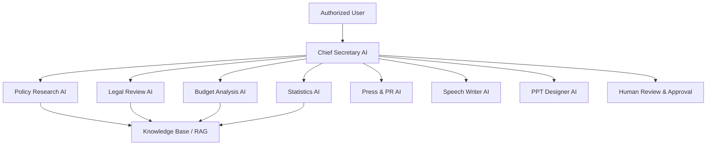

# AI Architecture

## Orchestration rules
- The Chief Secretary AI delegates but does not bypass permission checks.
- Specialist agents must return structured results.
- Every material claim should include source metadata or an uncertainty label.
- Agent runs are versioned by prompt, model, tool set, and policy version.
- External publication or official action requires human approval.
## Sprint 4 operational workflow
The deterministic Chief Secretary workflow supports policy, communication, presentation, and full-office packages. Full-office execution orders Policy Research, Legal Review, Budget Analysis, Statistics, Press/PR, SNS, Speech Writer, and PPT Designer. Operational outputs are typed artifacts and all public-facing drafts require human approval.

## Sprint 5 production integration

`OfficeApplicationService` is the application boundary between authenticated Work Package requests
and provider-neutral Office workflows. The composition root selects `fake`, `disabled`, or `openai`,
loads approved versioned prompts, injects one gateway into all specialist agents, and keeps provider
names out of agent behavior. The service creates task/package/run records, executes the existing
`OfficeWorkflowService`, then persists usage, provider audit metadata, artifacts, and final status.

Pending/running records are committed before external calls so failures remain observable. Final
results use a separate explicit commit; unexpected failures roll back uncommitted output before a
safe failed state is recorded. Partial completion is always `needs_review`; total failure is
`failed`; cancellation is persisted as `cancelled` and re-raised.

## Sprint 6 Checkpoint 4: Embedding and vector retrieval

- Embeddings use a provider-independent gateway (`fake`, `disabled`, or explicitly configured `openai`).
- Model, dimension, chunking configuration, normalization strategy, provider, and policy version participate in immutable embedding revisions.
- The default fake provider is SHA-256 deterministic and performs no network I/O. OpenAI uses bounded application retries while SDK retries are disabled.
- External embedding follows provider transmission policy: restricted content is blocked and confidential content requires organization policy. Embedding records never duplicate source text or secrets.
- Current persistence stores validated vectors as JSON for PostgreSQL/SQLite compatibility. `VectorStore` isolates this detail; production pgvector indexing is planned and must fail clearly if the extension is unavailable.
- Retrieval enforces organization, model, dimension, classification, document/source, effective-date, top-k, and minimum-score filters. Cosine scores remain in the native [-1, 1] range.
- Usage records capture input count/tokens, batch/retry count, latency, provider request ID and nullable estimated cost; pricing is not hard-coded.
- Public embedding/search HTTP endpoints are deferred; application services are the authorization-ready boundary.
