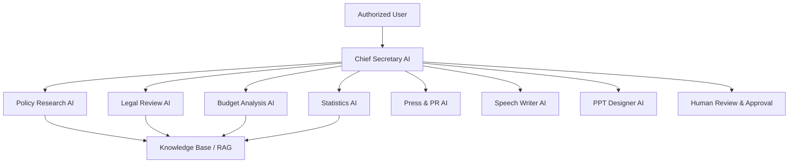

# AI Architecture

## Orchestration rules
- The Chief Secretary AI delegates but does not bypass permission checks.
- Specialist agents must return structured results.
- Every material claim should include source metadata or an uncertainty label.
- Agent runs are versioned by prompt, model, tool set, and policy version.
- External publication or official action requires human approval.
## Sprint 4 operational workflow
The deterministic Chief Secretary workflow supports policy, communication, presentation, and full-office packages. Full-office execution orders Policy Research, Legal Review, Budget Analysis, Statistics, Press/PR, SNS, Speech Writer, and PPT Designer. Operational outputs are typed artifacts and all public-facing drafts require human approval.

## Sprint 5 production integration

`OfficeApplicationService` is the application boundary between authenticated Work Package requests
and provider-neutral Office workflows. The composition root selects `fake`, `disabled`, or `openai`,
loads approved versioned prompts, injects one gateway into all specialist agents, and keeps provider
names out of agent behavior. The service creates task/package/run records, executes the existing
`OfficeWorkflowService`, then persists usage, provider audit metadata, artifacts, and final status.

Pending/running records are committed before external calls so failures remain observable. Final
results use a separate explicit commit; unexpected failures roll back uncommitted output before a
safe failed state is recorded. Partial completion is always `needs_review`; total failure is
`failed`; cancellation is persisted as `cancelled` and re-raised.

## Sprint 6 Checkpoint 4: Embedding and vector retrieval

- Embeddings use a provider-independent gateway (`fake`, `disabled`, or explicitly configured `openai`).
- Model, dimension, chunking configuration, normalization strategy, provider, and policy version participate in immutable embedding revisions.
- The default fake provider is SHA-256 deterministic and performs no network I/O. OpenAI uses bounded application retries while SDK retries are disabled.
- External embedding follows provider transmission policy: restricted content is blocked and confidential content requires organization policy. Embedding records never duplicate source text or secrets.
- Current persistence stores validated vectors as JSON for PostgreSQL/SQLite compatibility. `VectorStore` isolates this detail; production pgvector indexing is planned and must fail clearly if the extension is unavailable.
- Retrieval enforces organization, model, dimension, classification, document/source, effective-date, top-k, and minimum-score filters. Cosine scores remain in the native [-1, 1] range.
- Usage records capture input count/tokens, batch/retry count, latency, provider request ID and nullable estimated cost; pricing is not hard-coded.
- Public embedding/search HTTP endpoints are deferred; application services are the authorization-ready boundary.

## Sprint 6 Checkpoint 5: Hybrid retrieval and reranking

Hybrid retrieval normalizes Unicode with NFKC, preserves quoted phrases, removes forbidden controls, and uses a conservative Korean-aware tokenizer. The tokenizer only strips a small configured suffix set; it does not invent synonyms, and a future morphological adapter can replace it.

Lexical retrieval uses deterministic BM25-like term-frequency/IDF scoring with phrase, title, heading, and section boosts. Vector candidates reuse the provider-independent vector boundary, while production PostgreSQL full-text search remains behind an adapter protocol. Weighted max-normalized lexical scores and cosine-normalized vector scores are combined with reciprocal-rank fusion; stable chunk IDs break ties.

Deterministic reranking exposes authority, freshness, citation, and duplicate adjustments without hidden reasoning. Authority categories are configurable and never replace relevance. Exact duplicates within one source are collapsed, neighboring document results receive a penalty, and per-document/source caps preserve diversity. Evidence is sufficient, partial, or insufficient based on score, citation quality, official-source presence, freshness, and question-specific legal/budget needs.

Search telemetry stores a salted organization-scoped query hash, counts, filters, latency, provider/model, reranker, warnings, and evidence status. It never stores query or result text. Public `/knowledge/search/hybrid` routing is deferred until the application container can inject organization-scoped lexical/vector repositories; the service already enforces permissions and safe bounded contracts.

## Sprint 6 Checkpoint 6: Governed MCP gateway

MCP is an untrusted integration boundary governed by explicit server and tool allowlists. Five disabled-by-configuration connector definitions cover law, minutes, finance, internal documents, and public data. Fake clients are the test default; remote networking and local process execution require explicit opt-in and are not implemented as implicit fallbacks.

Every call validates active membership, RBAC permission, organization scope, classification, read/write consequences, human approval, JSON schemas, paths, URLs, result size, and suspicious prompt/script markers. Restricted data cannot leave PolicyOS; confidential external transmission needs organization policy. Cancellation propagates, retries are bounded to transient failures, and stale cache usage is disclosed.

Audit records contain identifiers, policy decisions, timing, retry/result counts and status only—never arguments, results, credentials, tokens, or document text. Cache keys are organization/classification scoped and hash normalized parameters. Connector outputs become untrusted `EvidenceCandidate` records with provenance and incomplete-citation warnings. Real national law, meeting, budget MCP connections, distributed cache, and management/execution HTTP APIs remain follow-up work.

## Sprint 6 Checkpoint 7: Governed knowledge routing

The Knowledge Router uses deterministic rules—not an LLM planner—to classify policy, legal, ordinance, minutes, budget, statistics, internal-document, speech, press, combined, and unknown queries. Its route matrix selects organization-scoped Hybrid RAG and allowlisted MCP connectors, runs independent sources concurrently within one timeout budget, preserves partial results, and records denied or failed sources instead of reporting false success.

Evidence is normalized into one contract, deduplicated by stable external/citation/content identity, capped per source/document, and ranked with retrieval relevance, official-source category, citation completeness, freshness and stable identifiers. Different institutions remain distinct. Legal effective-date and budget fiscal-year conflicts are surfaced without silently choosing a winner. Type-specific gaps lower confidence and material/critical gaps require human review.

Fallback provenance, stale warnings, source failures, permissions and review requirements remain visible. Restricted data cannot use external routes, and MCP receives only connector-specific parameters and opaque request metadata. Router audit stores query hashes, selected/executed/denied sources, counts, status, confidence and latency—never query text, evidence text, credentials, raw MCP results or reasoning. Real connector wiring and `/api/v1/knowledge/query` remain follow-up application-container work.
