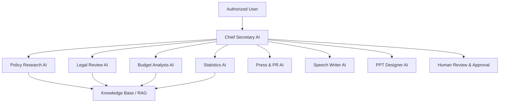

# AI Architecture

## Orchestration rules
- The Chief Secretary AI delegates but does not bypass permission checks.
- Specialist agents must return structured results.
- Every material claim should include source metadata or an uncertainty label.
- Agent runs are versioned by prompt, model, tool set, and policy version.
- External publication or official action requires human approval.
## Sprint 4 operational workflow
The deterministic Chief Secretary workflow supports policy, communication, presentation, and full-office packages. Full-office execution orders Policy Research, Legal Review, Budget Analysis, Statistics, Press/PR, SNS, Speech Writer, and PPT Designer. Operational outputs are typed artifacts and all public-facing drafts require human approval.

## Sprint 5 production integration

`OfficeApplicationService` is the application boundary between authenticated Work Package requests
and provider-neutral Office workflows. The composition root selects `fake`, `disabled`, or `openai`,
loads approved versioned prompts, injects one gateway into all specialist agents, and keeps provider
names out of agent behavior. The service creates task/package/run records, executes the existing
`OfficeWorkflowService`, then persists usage, provider audit metadata, artifacts, and final status.

Pending/running records are committed before external calls so failures remain observable. Final
results use a separate explicit commit; unexpected failures roll back uncommitted output before a
safe failed state is recorded. Partial completion is always `needs_review`; total failure is
`failed`; cancellation is persisted as `cancelled` and re-raised.
