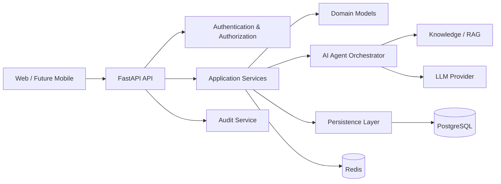

# System Architecture

## Architectural style
PolicyOS uses a modular layered architecture with explicit service boundaries.

## Layer responsibilities

### API layer
- HTTP routing
- request validation
- dependency injection
- response formatting
- authentication entry points

### Application service layer
- business workflows
- transaction boundaries
- orchestration
- authorization-aware operations

### Domain layer
- core business entities
- domain invariants
- reusable business rules

### Persistence layer
- SQLAlchemy access
- queries and repositories
- migrations
- database-specific concerns

### AI orchestration layer
- agent selection
- prompt assembly
- tool permissions
- source tracking
- execution records
- human review state

## Boundary rule
Routers must not contain substantial business logic. AI agents must not access unrestricted data or tools directly.

## Sprint 6 v0.4 release candidate

The governed Knowledge Platform release candidate is covered by a synthetic, network-free E2E flow from login and organization RBAC through combined internal RAG/fake MCP routing, cited evidence merge, conflict/gap and confidence assessment, eight-agent Chief Secretary orchestration, reviewable Work Package/artifact persistence, and safe API output. All fixture facts are explicitly fictional. Default CI forbids real OpenAI, remote MCP, and subprocess MCP calls.

Release operation requires Alembic head `20260720_0013`, reviewed environment settings, backup/rollback, retention dry-run, legal-hold protection, privacy incident handling, and provider/MCP outage procedures. See `RELEASE_NOTES_v0.4.md` and `RUNBOOK.md`. Production pgvector/ANN, real government connectors, workers, Redis coordination, scheduled cleanup, SIEM integrations, and live staging verification remain deferred.