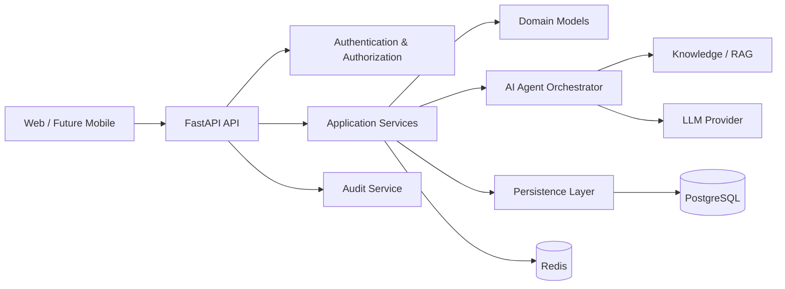

# System Architecture

## Architectural style
PolicyOS uses a modular layered architecture with explicit service boundaries.

## Layer responsibilities

### API layer
- HTTP routing
- request validation
- dependency injection
- response formatting
- authentication entry points

### Application service layer
- business workflows
- transaction boundaries
- orchestration
- authorization-aware operations

### Domain layer
- core business entities
- domain invariants
- reusable business rules

### Persistence layer
- SQLAlchemy access
- queries and repositories
- migrations
- database-specific concerns

### AI orchestration layer
- agent selection
- prompt assembly
- tool permissions
- source tracking
- execution records
- human review state

## Boundary rule
Routers must not contain substantial business logic. AI agents must not access unrestricted data or tools directly.
