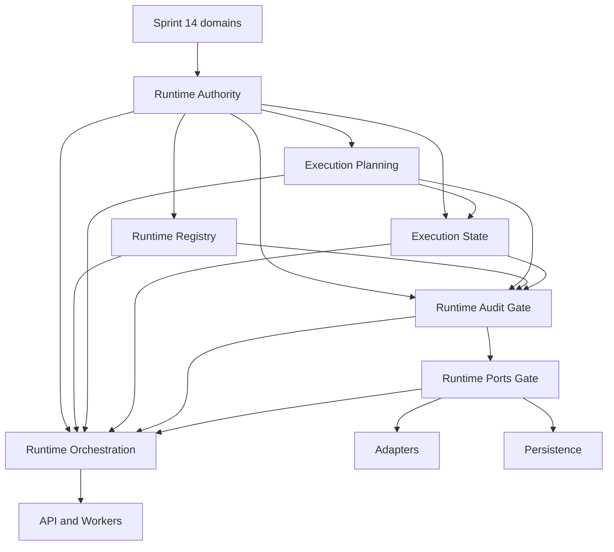

 Runtime Architecture Roadmap

## 1. Role of the runtime

The Sprint 15 runtime is the governed boundary between immutable policy-decision metadata and a
future side effect. It preserves exact authority, planning, state, action, audit, isolation, and
provenance facts while ensuring that possession of an upstream record never silently becomes
permission or execution.

The runtime does not decide policy correctness. DecisionPipeline is not an execution command,
ReleaseGate is not a permit, ExecutionPlan is not execution, execution state is not authority
state, and execution result is not a policy outcome.

## 2. Current and target state

### Current state - CP8 Runtime Delivery complete

- `app.runtime.authority`: immutable request, authority reference, permit reference, admission,
  revocation, bundle, audit-metadata, and pure validation contracts.
- `app.runtime.planning`: immutable metadata-only plans, steps, dependency graph, bindings,
  retry/timeout metadata, compensation references, validation records, and pure validation.
- `app.runtime.state`: immutable explicit transition request/decision/record contracts,
  optimistic revisions, append-only history, terminal states, and pure validation.
- `app.runtime.registry`: immutable action definitions, lifecycle entries, tenant/organization-bound
  snapshots, exact resolution facts, side-effect requirements, and pure validation.
- `app.runtime.audit`: immutable append-only safe event and trail contracts with pure validation.
- `app.runtime.ports`: implementation-neutral adapter, repository, transaction, initial outbox,
  clock, cancellation, and credential-broker Protocols and immutable boundary contracts.
- `app.runtime.orchestration`: governed one-call invocation and caller-supplied atomic outcome
  coordination through Ports only.
- `app.runtime.adapters`: deterministic fake and dry-run implementations with no external effect.
- `app.runtime.persistence`: PostgreSQL repositories, optimistic append, initial outbox storage,
  and local atomic State, Audit, Idempotency, and optional enqueue commit.
- CP7 Acceptance proves the Request-to-read-back vertical slice with the production Fake Adapter
  and PostgreSQL without changing production behavior.
- CP8 PostgreSQL Delivery Persistence merged in PR #53, Lifecycle Port conformance in PR #54,
  and governed Delivery Orchestration in PR #55.
- PR #56 corrected Alembic 0007 asyncpg execution, and PR #57 corrected repeated lifecycle
  projection cardinality. PR #65 merged the definition-only Runtime permissions, PR #66 merged
  grant/revoke governance, and PR #67 merged governed grant provisioning. The current migration
  head is `20260808_0021`.
- The CP8 Runtime Delivery Acceptance Gate passed PostgreSQL 16 verification and green CI and
  merged in PR #58. CP8 Runtime Delivery is complete within its approved local delivery boundary.
  No real external adapter, runtime API, Worker, queue, polling loop, scheduler, live credential
  resolver, or external effect exists.

### Target state - Planned

The ADR-085 delivery-contract gate, ADR-086 persistence-contract gate, Persistence, governed
Delivery Orchestration, blocker corrections, and PostgreSQL Acceptance evidence are merged. The
next planned checkpoint is CP9 Runtime API under its own governance, authentication/RBAC mapping,
and transport-security entry conditions; this closeout does not implement CP9. Real adapters,
credential resolution, authenticated API transport, and Workers remain separate future work.

## 3. Program sequence versus dependency order

The fixed delivery sequence is CP0 Architecture, CP1 Authority, CP2 Planning, CP3 State, CP4
Registry, CP5 Orchestration, CP6 Adapters, CP7 Persistence, CP8 Outbox, CP9 API, and CP10 Workers.

The architecture dependency order is different. State consumes Planning and Authority;
Orchestration consumes Registry, Planning, State, Audit and Ports; Adapters implement Ports;
Persistence implements repository/outbox-storage Ports; and API/Workers call the
application/orchestration boundary. Because CP2 and CP3 preceded the CP4 registry implementation,
CP4 defines independent registry contracts with action identity, version, registry revision,
schema reference, and selector shapes that are structurally and semantically compatible with the
opaque references already recorded by CP2. Registry production code imports neither Planning nor
State and does not consume `ExecutionPlan` objects. Actual plan-to-registry binding validation is
downstream of Registry, Planning and State in an approved application/orchestration boundary.
Changing Planning to import Registry requires separately approved scope and regression review;
CP2 and CP3 public contracts remain unchanged.

ADR-077 fixes Audit and Ports as separate prerequisite gates before CP5. CP5-Gate-Audit is first;
CP5-Gate-Ports begins only after Audit merges. These gates do not renumber CP5 through CP10.
ADR-083 adds a narrow CP7-Gate-Commit-Facts prerequisite without renumbering CP7. It supplies
caller-bound receipt and digest facts and an injected-clock reference before Persistence begins.
ADR-085 adds `CP8-Gate-Delivery-Contracts` without renumbering CP8. It resolves package placement
and external-effect semantics and merged in PR #50. ADR-086 adds the additive
`CP8-Gate-Delivery-Persistence-Contracts`, which merged in PR #52 before PostgreSQL delivery
Persistence implementation began.

## 4. Dependency view



Arrows mean "is an input contract or required boundary for," not authority delegation. No arrow
grants permission or causes automatic execution.

## 5. CP0-CP10 roadmap

| CP | Status | Layer or decision | Primary output | Principal gate |
| --- | --- | --- | --- | --- |
| CP0 | Merged | Architecture | ADR-065 through ADR-072 and normative rules | No runtime package created by CP0 |
| CP1 | Merged | Authority | Immutable authority bundle and validation | No issuance or execution |
| CP2 | Merged | Planning | Immutable plans and validation records | Plan remains inert |
| CP3 | Merged | State | Explicit append-only transition metadata | No automatic progress |
| CP4 | Merged | Registry | Action definitions and immutable snapshots | No executable registration |
| CP5-Gate-Audit | Merged | Audit | Safe append-only event contracts | Audit is not authority |
| CP5-Gate-Ports | Merged | Ports | Adapter/repository/outbox/clock/broker protocols | Protocols have no implementation |
| CP5 | Merged | Orchestration | Pure governed coordination | Requires Registry, Audit, and Ports |
| CP6 | Merged | Adapters | Deterministic fake and dry-run adapters | No external effect or credential resolution |
| CP7-Gate-Commit-Facts | Merged | Ports receipt provenance | Caller-bound receipts, digest and clock reference | No hidden generation |
| CP7 | Merged | Persistence | Repositories, migrations, local transactions | Storage owns no policy |
| CP7-Acceptance | Merged | PostgreSQL vertical evidence | Atomic commit and exact read-back | PostgreSQL pass required |
| CP8-Gate-Delivery-Contracts | Merged, PR #50 | Delivery contracts | Effect lifecycle and reconciliation contracts | No external delivery |
| CP8-Gate-Delivery-Persistence-Contracts | Merged, PR #52 | Persistence boundary | Atomic effect facts and lifecycle receipts | Contracts precede implementation |
| CP8 PostgreSQL Delivery Persistence | Merged, PR #53 | Persistence | Four-table storage, replay, due selection and lifecycle CAS | Storage owns no policy |
| CP8 Lifecycle Port conformance | Merged, PR #54 | Persistence conformance | `append(request)` alignment | No schema change |
| CP8 Runtime Delivery Orchestration | Merged, PR #55 | Orchestration | Governed delivery and reconciliation | Ports only |
| CP8 Runtime Delivery Acceptance Gate | Merged, PR #58 | Vertical evidence | PostgreSQL crash-window scenarios | No external exactly-once claim |
| CP8 closeout | Merged, PR #59 | Governance closeout | CP8 completion evidence | No Worker, queue, API, or `app.runtime.outbox` |
| CP8 | Merged | Effect delivery | Local atomic delivery and reconciliation boundary | External exactly-once is not guaranteed |
| CP9 Governance / ADR-087 | Merged, PR #60 | API boundary | Principal, RBAC, threat and placement decisions | No production route |
| CP9-Gate-API-Contracts | Merged, PR #61 | API contracts | Immutable principal, scope, facade, idempotency and safe error contracts | Contracts do not create a production API |
| CP9-Gate-Auth-Claims | Merged, PR #62 | Authentication trust | Required issuer/audience, HS256-only zero-leeway verification, immutable verified claims, legacy-token rejection and generic bearer failures | Focused authentication regression complete |
| CP9-Gate-Tenant-Organization-Binding-Governance | Merged, PR #63 | Binding governance | Lifetime one-to-one cardinality, explicit provisioning, immutable classification ceiling, no rebinding or privileged bypass, and fail-closed downgrade | Governance baseline only |
| CP9-Gate-Tenant-Organization-Binding | Merged, PR #64 | Binding persistence | Lifetime one-to-one model, explicit persistence, self-contained migration `20260807_0018`, fail-closed downgrade, trusted resolver, and PostgreSQL 16 verification | No production Runtime route or provisioning surface |
| CP9-Gate-Runtime-Permission-Definitions | Merged, PR #65 | RBAC definitions | Definition-only persistence of exact `runtime.read`, `runtime.invoke`, and `runtime.reconcile` permissions in migration `20260807_0019` | No automatic grants or existing role/membership backfill |
| CP9-Gate-Runtime-Grant-Governance | Merged, PR #66 | RBAC grant governance | ADR-088 fixes exact management authority, immutable append-only ledger, replay, scope, and transaction semantics | Governance precedes production provisioning |
| CP9-Gate-Runtime-Grant-Provisioning | Merged, PR #67 | RBAC grant persistence | Atomic projection and append-only ledger, exact replay, scoped authority revalidation, concurrency, and PostgreSQL 16 evidence | Automatic management grants remain zero |
| CP9-Gate-Runtime-Permission-Fact-Resolver-Governance | Merged, PR #69 | RBAC resolution governance | ADR-089 fixes server-owned operation mapping, live projection authority, non-disclosure, and revocation linearization | Governance baseline; no facade or route |
| CP9-Gate-Runtime-Permission-Fact-Resolver | Merged, PR #70 | RBAC resolution | Transaction-bound SQLAlchemy resolution of exact live `RolePermission` facts | No cache, migration, facade, route, or transport |
| CP9-Gate-Transport-Idempotency-Governance | Merged, PR #71 | Mutation replay governance | ADR-090 fixes scoped identity, explicit command version, canonical digest, immutable receipts, and transaction linearization | Migration `0021` is planned only |
| CP9-Gate-Transport-Idempotency-Contracts | Merged, PR #72 | Mutation replay contracts | Adds bounded command version, explicit commit facts, atomic commit protocol, and exact replay equality | No persistence, migration, facade, or route |
| CP9-Gate-Transport-Idempotency-Atomic-Commit-Contract-Correction | Merged, PR #73 | Mutation callback ordering | Requires lock and replay/conflict resolution before invoking one bounded local mutation | No facade or route |
| CP9-Transport-Idempotency | Merged, PR #74 | Mutation replay persistence | Immutable `runtime_api_idempotency_receipts`, migration `20260808_0021`, and caller-owned transaction service | Facade and routes remain blocked |
| CP9-Gate-Trusted-Application-Facade-Governance | Merged, PR #75 | Facade trust boundary | ADR-091 fixes transaction ownership, trusted fact binding, canonical digest construction, and safe errors | Governance only; no facade or route |
| CP9-Gate-Trusted-Application-Facade-Contracts | Merged, PR #76 | Facade contracts | Transport-safe inputs, verified claims, organization selector, explicit server facts, exact permissions, and canonical digests | No production facade or route |
| CP9-Gate-Trusted-Application-Facade-Fact-Binding-Contracts | Merged, PR #77 | Fact-binding contracts | Explicit trusted-context facts, clock-free resolver input, orchestration binder Protocol, and local-operation Protocol | No concrete binder, facade, or route |
| CP9-Trusted-Application-Facade | Merged, PR #78 | Production facade | One SQLAlchemy transaction binds trusted context, exact permission, canonical digest, idempotency, and a bounded local operation | Concrete binder/local-operation implementation and routes remain blocked |
| CP9-Gate-Local-Fact-Binding-and-Transaction-Integration-Governance | Merged, PR #79 | Local integration governance | ADR-092 fixes exact persisted orchestration facts, Registry snapshot provenance, and active-transaction Persistence boundaries | Governance only |
| CP9-Gate-Local-Fact-Binding-and-Active-Transaction-Persistence-Contracts | Merged, PR #80 | Local integration contracts | Adds exact persisted record, permit, Registry, scope, lineage, operation-binding, and caller-owned active-transaction Ports contracts | No concrete binder, store, migration, or route |
| CP9-Gate-Registry-Resolution-and-Admission-Exactness-Contracts | Merged, PR #81 | Exactness contract correction | Binds persisted Registry snapshot/reference, resolution request/decision, and admission decision identities and scope fail closed | No Registry snapshot persistence, concrete binder/local operation, migration, or route |
| CP9-Gate-Registry-Snapshot-Persistence-and-Active-Transaction-Integration-Governance | Governed, pending review | Persistence and transaction governance | ADR-093 requires a separate append-only Registry store, migration `20260808_0022`, exact admission binding, and caller-session participation | Governance only; no model, migration, store, binder, or route |
| CP9-Gate-Active-Transaction-Write-Set-and-Session-Binding-Governance | Governed, pending review | Atomic local persistence governance | ADR-094 selects existing closed atomic/reconciliation payloads, rejects marker staging, and requires one-shot exact session/root-transaction binding | Governance only; public contracts and implementation remain separate |
| CP9-Gate-Reconciliation-Request-Persistence-Ownership-and-Atomic-Integration-Sequencing | Governed, pending review | Reconciliation persistence governance | ADR-095 assigns the existing strict reconciliation request to a dedicated append-only Persistence table in `0022` and fixes checkpoint sequencing | Governance only; no production model, migration, repository, facade, or route |
| CP9 Registry/Reconciliation Persistence and One-Shot Active Transaction | Implemented, pending review | Persistence implementation | Migration `20260808_0022`, seven append-only tables, strict Registry serialization/repositories, and exact caller-session/root one-shot staging | Concrete binder/facade composition and routes remain separate blockers |
| CP9-Gate-Explicit-Integration-Facts-and-Request-Scoped-Persistence-Binding | Governed, validated, pending review | Concrete integration governance | ADR-096 preserves five-parameter facade methods and defines required nested operation facts, request-scoped preparation, exact persisted re-read, and closed mutation dataflow | Governance only; contract amendment, concrete integration, and routes remain blocked |
| CP9 Explicit Integration Facts Public Contracts | Implemented, validated, pending review | Contract amendment | Adds required strict operation integration facts, pure exact-equality validation, command/query carriage, and a request-scoped provider Protocol | No provider, binder, local operation, facade behavior, route, model, migration, or repository implementation |
| CP9-Gate-Authoritative-Result-and-Query-Projection-Ownership | Governed, validated, pending review | Result/projection governance | ADR-097 assigns new mutation results to a one-shot domain callback, replay results to transport receipts, and query projections to an exact read-only persisted-state Port | Separate public-contract amendment required; no schema or implementation |
| CP9-Gate-Runtime-Lifecycle-and-Public-Projection-Domain-Governance | Governed, validated, pending review | Lifecycle projection governance | ADR-098 defines the total state-to-public-status mapping, result cardinality, persisted state-revision digest authority, and request-scoped exact locator | Governance only; three follow-up gates remain |
| CP9-Gate-Runtime-Lifecycle-Public-Contracts | Implemented, validated, pending review | Public lifecycle contracts | Adds the ADR-098 statuses, immutable total mapping, strict cardinality enum, and pure fail-closed count validation | Persistence/read and integration remain deferred |
| CP9 | Planned / Blocked | API | `app.api`, `app.schemas`, trusted application facade | Requires production facade implementation and routes |
| CP10 | Planned | Workers | Governed persisted-work consumers | No inferred policy or hidden retry |

CP9 Governance / ADR-087 is merged in PR #60, API Contracts in PR #61, Auth Claims in PR #62,
Tenant-Organization Binding Governance in PR #63, Binding in PR #64, and definition-only Runtime
permissions in PR #65. ADR-088 governance merged in PR #66 and governed Runtime grant provisioning
merged in PR #67 with migration head `20260808_0020`. Permission-fact resolver governance and its
production resolver merged in PR #69 and PR #70 without a route or facade. Routes remain in
`app.api`; `app.runtime.api` and
`app.runtime.outbox` remain prohibited. CP9 remains Planned / Blocked, CP10 Workers remain Planned,
and external business-effect exactly-once remains unguaranteed. Blind retry and automatic redrive
remain prohibited.

The required implementation order is:

1. Merge ADR-092 local integration governance.
2. Merge additive binding and active-transaction Persistence contracts (PR #80).
3. Merge the Registry resolution and admission exactness contract correction gate (PR #81).
4. Merge ADR-093 Registry snapshot persistence and active-transaction integration governance.
5. Merge ADR-094 write-set and caller-session binding governance and its public-contract gate.
6. Merge ADR-095 reconciliation-request persistence ownership and atomic-integration sequencing.
7. Implement migration `20260808_0022`, the separate Registry store, dedicated
   reconciliation-request store, and active-transaction
   persistence in their approved checkpoint.
8. Implement the concrete binder and local operation in a separate checkpoint.
9. Implement production Runtime routes.
10. Run combined CP9 PostgreSQL and HTTP acceptance.
11. Complete CP9 closeout.
12. Begin CP10 only after separate approval.


## 6. Boundary input and output contracts

### Authority

- **Inputs:** Exact execution subject and request, external review/approval/authorization facts,
  bounded external permit facts, revocations, identities, selectors, revisions and lineage.
- **Outputs:** Validated immutable authority bundle and admission decision metadata.
- **Never outputs:** Approval, authorization, permit issuance, execution, state, or result.

### Planning

- **Inputs:** Admitted authority bundle, exact DecisionPipeline identity, caller-supplied action and
  registry references, steps, dependency and binding metadata.
- **Outputs:** Immutable validated plan and validation records.
- **Never outputs:** Registry discovery, adapter invocation, authority, state transition, or I/O.

### State

- **Inputs:** Exact authority/plan references, transition request, transition decision, optimistic
  revision, idempotency key, attempt, scope, lineage and timestamps.
- **Outputs:** Append-only transition record and validated immutable state history.
- **Never outputs:** Authority, automatic lifecycle progress, retry execution, cancellation,
  compensation, persistence, or a policy outcome.

### Registry

- **Inputs:** Governed action identity/version, schema references, capabilities, risk,
  side-effect level, permit/destination/idempotency/retry/compensation rules, adapter reference,
  registry snapshot identity and revision.
- **Outputs:** Immutable canonical action definitions and snapshot resolution facts.
- **Never outputs:** Callback, executable import, credential, permit, policy decision, adapter
  invocation, or runtime self-registration.

### Audit

- **Inputs:** Safe bounded facts from authority-relevant transitions and side-effect lifecycle.
- **Outputs:** Append-only immutable event contracts with exact scope and provenance references.
- **Never outputs:** Authorization, correctness, payload transport, or unrestricted content.

### Ports

- **Inputs/outputs:** Typed protocols for adapter invocation, bounded results/errors, repositories,
  transactions, outbox, clock, cancellation and tenant-scoped credential resolution.
- **Never outputs:** Implementation, default provider, global credential, or policy decision.

### Orchestration

- **Inputs:** Validated authority, registry, plan, state and audit contracts plus port protocols.
- **Outputs:** Explicit requests and coordination results over supplied facts.
- **Never outputs:** Invented authority, direct external call, implicit transition, retry,
  cancellation, compensation, or correctness claim.

### Adapters

- **Inputs:** Fully validated invocation envelope, exact permit and registry binding, READY or
  RUNNING state, idempotency/attempt metadata, destination and tenant credential reference.
- **Outputs:** Bounded result/artifact references or typed errors.
- **Never outputs:** Policy, permit, state mutation, API response, unrestricted provider payload,
  or stored credential.

### Persistence and outbox

- **Inputs:** Validated runtime facts and application-boundary commands.
- **Outputs:** Repository facts, optimistic revision/uniqueness outcomes, atomic local transaction
  records, delivery attempts, dead-letter and reconciliation facts.
- **Never outputs:** Policy decisions, external atomicity, inferred success, or direct authority.

### API and workers

- **Inputs:** Authenticated/scoped API commands or persisted governed work.
- **Outputs:** Calls to and bounded responses from the runtime application boundary; recorded
  worker attempts.
- **Never outputs:** Direct adapter/repository bypass, inferred authority, secrets, or raw payloads.
- **Placement:** CP9 routes remain in the existing `app.api` layer and workers remain external
  application/infrastructure entry points. Dedicated `app.runtime.api` or `app.runtime.workers`
  packages require a separately approved superseding ADR.

## 7. Registry binding model

The Action Registry connects intent to an enumerable execution boundary:

```text
action identity and version
  -> required permit rules
  -> risk profile and side-effect classification
  -> input/output schema references
  -> destination and idempotency requirements
  -> retry and compensation eligibility
  -> adapter identity and version reference
  -> optional provider/model/tool/connector selectors
  -> immutable registry snapshot and revision
```

The registry declares this relationship but executes nothing. Adapter selection does not grant
authority. Unknown, disabled, substituted, or revision-mismatched actions fail closed.

## 8. Unified selector policy

Model, provider, connector, MCP, internal action, repository operation, and other adapter families
use the same policy comparison dimensions where applicable:

- tenant and organization;
- actor, agent instance, and represented user;
- resource, action, purpose, and risk level;
- classification and execution environment;
- destination;
- model, provider, tool, and connector identifiers;
- request, plan, step, attempt and idempotency identities;
- policy, authorization and registry revisions;
- lineage and provenance references;
- permit validity, revocation, invocation and attempt bounds.

An omitted applicable selector fails closed. A later boundary cannot broaden, substitute, infer,
or lower any selector. Specialized one-request MCP permits and replay-protected repository permits
remain authoritative and are not replaced by a broader runtime permit.

## 9. Fake and dry-run first

CP6 starts with fake and dry-run model, provider, MCP, connector, and approved external/internal
action adapters implementing the exact approved ports. Repository and transaction/outbox-storage
port implementations belong to CP7 Persistence and are not adapter families. Adapters do not call
repositories or bypass State or the application/policy boundary. Fake adapters provide
deterministic test references without external I/O. Dry-run adapters perform no side
effect and create no authority; dry-run success is not admission, permit validity, or evidence of
future execution success. Real adapters require separate enablement, threat review, destination
controls, tenant-bound credential resolution and immediate permit revalidation.

## 10. Persistence and transaction boundary

Repository interfaces live in Ports; implementations live in Persistence. Repositories store and
retrieve validated facts and enforce tenant-partitioned uniqueness and optimistic revisions. They
do not approve, authorize, issue permits, select actions, progress state, retry work, or invoke
adapters.

Where supported, state change, audit event, idempotency reservation and outbox record commit in
one local transaction. External side effects are never claimed transactionally atomic with local
storage. Migration ownership belongs to runtime persistence. ADR-083 selects PostgreSQL 16,
SQLAlchemy 2 asynchronous Sessions, explicit transaction ownership, logical tenant partitioning,
and preservation-only retention for CP7. CP7 performs no purge; physical partitioning and any
destructive retention schedule require later operational evidence and approval.

Repository write requests carry their exact receipt identifiers. Atomic write sets carry typed
record receipt facts, a transaction receipt identifier, a transaction digest reference, and an
injected clock reference. Persistence echoes and stores those facts and observes commit time from
the named clock Port; it does not invent identifiers, digests, State, Audit, Idempotency, or
Outbox facts. ADR-084 samples and validates that injected clock at the commit boundary so the exact
reading is part of the database transaction, then publishes the receipt only after commit succeeds.

## 11. Outbox, idempotency and reconciliation

ADR-085 resolves R15-07 without creating `app.runtime.outbox`. Immutable delivery contracts and
Protocols extend `app.runtime.ports`; PostgreSQL storage extends `app.runtime.persistence`; and
governed delivery behavior extends the existing `app.runtime.orchestration` application boundary.
Adapters remain the only Runtime implementations that perform approved external effects. Future
CP10 Workers call Orchestration and never access Persistence, repositories, credential brokers, or
adapters directly.

`CP8-Gate-Delivery-Contracts` merged in PR #50 with the effect identity, reference-only delivery
envelope, closed lifecycle, claim, lease, attempt, retry, dead-letter, reconciliation, Protocol,
pure-validation, and architecture-test surface. It created no SQLAlchemy model, migration,
dispatcher, queue, Worker, API, network call, retry loop, or external effect.

ADR-086 fixes the PostgreSQL baseline, and `CP8-Gate-Delivery-Persistence-Contracts` merged in PR
#52. PostgreSQL Delivery Persistence merged in PR #53, Lifecycle Port conformance in PR #54, and
governed Delivery Orchestration in PR #55. Migration `20260805_0016_runtime_effect_delivery.py` creates
exactly `runtime_effects`, `runtime_effect_lifecycle_heads`,
`runtime_effect_lifecycle_revisions`, and `runtime_effect_reconciliation_observations`. Dedicated
claim, attempt, result, retry, and dead-letter tables remain deferred pending an approved
independent lookup or retention need.

PostgreSQL 16.14 verification passed: scenarios 12 passed; focused 2 passed; combined CP8 and CP7
PostgreSQL 22 passed; Ports, Delivery, and Architecture 46 passed; order A 177 passed with skip 0;
order B 177 passed with skip 0; and migration upgrade, downgrade, and parity checks passed.

PR #56 corrected Alembic 0007 asyncpg execution, PR #57 added lifecycle projection cardinality,
and Runtime grant provisioning migration `20260808_0020` precedes the current `20260808_0021` head. PR #58 merged the PostgreSQL
crash-window and vertical Acceptance Gate with green CI, completing CP8 Runtime Delivery. No
`app.runtime.outbox`, Worker, queue, polling loop, scheduler, or API is introduced, and external
exactly-once business effects are not guaranteed.

- Effect-level idempotency uses one caller-supplied stable effect identity across attempts. Its
  tenant, organization, request, plan step, action, destination, payload reference and digest,
  classification, lineage, and idempotency key cannot change. Attempt identity is explicitly
  excluded from effect-level uniqueness.
- Identical replay may return the recorded effect or result reference; mismatched effect or
  idempotency reuse fails closed.
- The local initial enqueue, State, Audit, and attempt-level Idempotency facts commit atomically.
  PostgreSQL uniqueness and optimistic revisions protect local effects and lifecycle facts.
- External effects are not transactionally atomic with PostgreSQL. PolicyOS makes no global
  exactly-once business-effect claim and uses no distributed or two-phase commit.
- Delivery is evidence-aware. A definitely-not-delivered failure may enter a bounded governed
  retry path; acknowledgement loss or unknown destination state becomes explicit ambiguity and
  does not retry automatically.
- Retry is explicit, action-eligible, attempt-bounded, eligible-time-bound, and uses a new governed
  attempt with fresh authority, permit, cancellation, deadline, and credential validation.
  Publication, deployment, destructive, quarantine, legal-hold, access-control, credential, and
  security-control actions do not retry automatically.
- One effect has at most one active unexpired local claim. A claim or lease is concurrency metadata
  and grants no authority, permit, credential, retry, or effect permission.
- Dead-letter records are terminal append-only facts with safe bounded failure and attempt
  references. CP8 performs no automatic redrive.
- Reconciliation records only confirmed delivered, confirmed not delivered, still ambiguous, or
  observation unavailable. It compares authorized external observations with immutable local
  evidence and never invents success.
- Cancellation is a distinct action/state transition and is not rollback. Compensation is a
  separately registered action with separate authorization and permit and is not guaranteed
  rollback.

## 12. API and worker authority limits

The API authenticates, validates transport schemas and invokes the runtime application boundary.
Runtime routes remain in the existing `app.api` layer; CP9 does not create `app.runtime.api`
without a separately approved superseding ADR. It does not own authority, call adapters, mutate
state directly, expose secrets, or access
repositories to bypass policy.

Workers are external application/infrastructure entry points, not `app.runtime` domain packages.
CP10 does not create `app.runtime.workers` without a separately approved superseding ADR. Worker
package placement, queue, lease, scheduling, and identity are decided before implementation.
Workers consume only persisted governed work. They use scoped worker identity, revalidate tenant,
organization, registry, authority and permit, call the orchestration/ports boundary, and record
attempts. They do not infer missing policy, bypass isolation, call adapters directly, or perform
hidden retry/cancellation/compensation.

## 13. Threats and defenses by checkpoint

| CP | Primary threat | Required defense |
| --- | --- | --- |
| CP0 | Ambiguous ownership or reverse dependency | Frozen layers, normative rules, dependency guards |
| CP1 | Intent treated as authority or permit broadened | Separate facts, exact scope, bounded permit validation |
| CP2 | Plan treated as execution or authority expanded | Inert metadata, exact bindings, acyclic canonical graph |
| CP3 | State treated as authority or advanced automatically | Explicit request/decision/record, optimistic revision, terminal history |
| CP4 | Arbitrary executable registration | Immutable snapshots, no callbacks/import paths, fail-closed resolution |
| CP5 gates | Audit or ports acquire policy/implementation | Safe events and protocol-only contracts |
| CP5 | Orchestrator bypasses authority or calls external systems | Pure coordination, explicit requests, ports only |
| CP6 | Adapter chooses policy, leaks credentials, or redirects | Validated envelope, brokered credentials, exact destination and permit |
| CP7 | Repository advances state or crosses tenants | Contract tests, transaction boundary, partitioned uniqueness |
| CP8 | Duplicate/unbounded effects or invented success | Idempotency, bounded retry, dead-letter and reconciliation |
| CP9 | Route bypasses runtime or exposes sensitive data | Authentication/RBAC, thin transport, safe schemas/errors |
| CP10 | Worker infers authority or silently repeats work | Persisted governed work, lease/attempt records, revalidation |

## 14. Capabilities not yet implemented

The following are Planned or Decision required, not current capabilities: tenant credential
broker implementation, real model/provider/MCP/connector calls, runtime repositories, migrations,
transaction manager, persistence I/O, outbox dispatch, dead-letter processing, reconciliation
jobs, runtime API, workers, queues, schedulers, live cancellation, compensation execution,
operational retries, and external effects. Existing fake and dry-run adapters perform no external
effect.

## 15. CP5 prerequisite-gate plan

- Merge ADR-077 and the corrected `AGENTS.md` dependency summary first.
- Implement CP5-Gate-Audit on a dedicated branch and PR with its own implementation ADR.
- Keep Audit immutable, append-only, safe, deterministic, and free of authority or transport.
- Merge Audit with green CI before opening the Ports implementation gate.
- Implement CP5-Gate-Ports on a separate branch and PR with its own implementation ADR.
- Keep Ports protocol-only and free of Orchestration or infrastructure implementations.
- Continue prohibiting `app.runtime.orchestration` until both gates merge independently.
- Define the application-boundary contract in the CP5 implementation ADR before orchestration.

## 16. Preparation after CP10

Before Sprint 15 Final Review, integrate architecture, security, migration, transaction, adapter,
outbox, API and worker test evidence; verify operational recovery, dead-letter and reconciliation;
review tenant/classification/retention controls; update runbooks; resolve or formally defer open
decisions; and make a separate project release-version decision. A Git tag, production enablement,
or release publication is not implied.

## 17. Deferred to Sprint 16 or later

- General-purpose runtime plugin or dynamic action ecosystems.
- Automatic policy synthesis, approval, permit issuance, or action discovery.
- Cross-tenant/global fallback execution.
- Unbounded autonomous retry, remediation, cancellation or compensation.
- Exactly-once external business-effect guarantees.
- Provider-specific optimization not expressed through governed ports.
- Broader UI/operations experiences beyond the reviewed Runtime API and worker boundaries.
- Any new runtime layer not explicitly approved after Sprint 15 Final Review.

## 18. Governance decisions and remaining downstream work

ADR-077 and the corrected operating rule resolve the CP5 dependency-order and review-unit
decisions. ADR-065 remains canonical: Registry, Audit, and Ports are inputs to Orchestration;
Planning and Registry remain independent under ADR-076. Audit and Ports are separate prerequisite
gates and each requires its own implementation ADR and merged PR.

ADR-078, ADR-079, and ADR-081 define the merged Audit, Ports, and Orchestration surfaces. ADR-085
resolves CP8 package placement and external-effect semantics: Ports own contracts, Persistence owns
storage, Orchestration owns governed delivery coordination, Adapters own exact effects, and no
`app.runtime.outbox` package is approved. The delivery-contract gate merged in PR #50. ADR-086
blocks CP8 production implementation until `CP8-Gate-Delivery-Persistence-Contracts` merges with
green CI. CP9 routes remain in `app.api`, and Workers remain external entry points unless
superseding ADRs approve different placement. Roadmap documentation does not resolve or supersede
those later decisions.

CP9-Gate-Runtime-Permission-Definitions merged in PR #65, grant governance merged in PR #66, and
governed grant provisioning merged in PR #67, permission-fact resolver governance merged in PR #69,
and the resolver merged in PR #70. CP9 Runtime API remains Planned / Blocked pending transport
idempotency persistence, the trusted application facade, and production routes. CP10 remains
Planned.

ADR-089 proposes live permission-fact resolution from the current `RolePermission` projection,
server-owned operation-to-permission mapping, per-operation resolution without caches, and a shared
transaction boundary that linearizes local requests with grant and revoke commits. The governance
gate and resolver are merged; no facade or route is added.

ADR-090 proposes mutation-only transport replay using a trusted scoped identity, explicit
`command_version`, canonical digest, transaction-scoped PostgreSQL advisory lock, and immutable
bounded receipt. Migration `20260808_0021_runtime_api_idempotency.py` is planned only and does not
exist in this governance gate.

ADR-090 governance merged in PR #71. `CP9-Gate-Transport-Idempotency-Contracts` adds only immutable
bounded contracts, explicit caller-supplied commit facts, one atomic commit protocol, and exact
replay equality. Production persistence, migration `0021`, facade, and routes remain blocked.

The contracts gate merged in PR #72. The atomic commit contract correction passes an immutable
local-mutation Protocol into the transaction port so lock and receipt resolution precede mutation.
Exact replay and conflict invoke no mutation; a new identity awaits it exactly once before staging
the bounded receipt. The caller owns commit and rollback, and external exactly-once is not claimed.

### CP9 governed Runtime permission provisioning

Production provisioning preserves `RolePermission` as the active projection and records every
committed grant or revoke in the append-only `runtime_permission_grant_events` ledger in the same
transaction. `runtime.grant.manage` is definition-only with zero automatic grants; only
`runtime.read`, `runtime.invoke`, and `runtime.reconcile` are eligible targets. Exact replay is
receipt-stable, conflicting replay and concurrent state changes fail closed, and transport,
permission-fact resolution, application facade/routes, outbox, and CP10 remain deferred.
