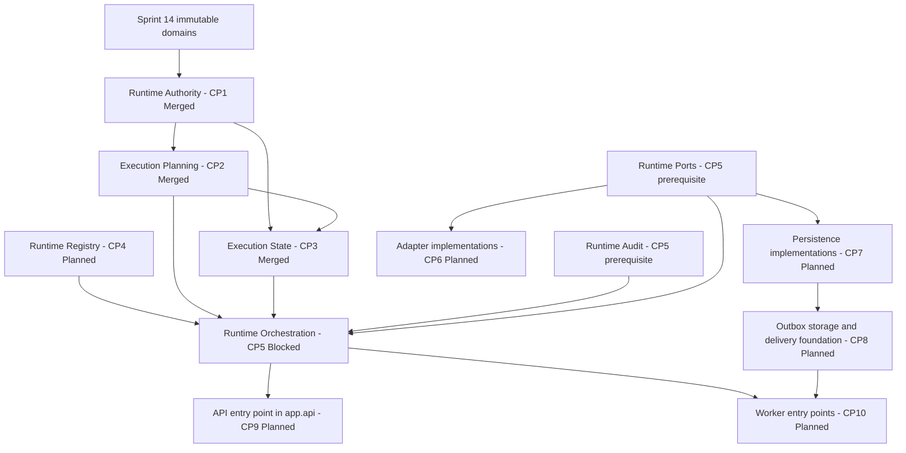

# Runtime Architecture Roadmap

## 1. Role of the runtime

The Sprint 15 runtime is the governed boundary between immutable policy-decision metadata and a
future side effect. It preserves exact authority, planning, state, action, audit, isolation, and
provenance facts while ensuring that possession of an upstream record never silently becomes
permission or execution.

The runtime does not decide policy correctness. DecisionPipeline is not an execution command,
ReleaseGate is not a permit, ExecutionPlan is not execution, execution state is not authority
state, and execution result is not a policy outcome.

## 2. Current and target state

### Current state - Merged through CP3

- `app.runtime.authority`: immutable request, authority reference, permit reference, admission,
  revocation, bundle, audit-metadata, and pure validation contracts.
- `app.runtime.planning`: immutable metadata-only plans, steps, dependency graph, bindings,
  retry/timeout metadata, compensation references, validation records, and pure validation.
- `app.runtime.state`: immutable explicit transition request/decision/record contracts,
  optimistic revisions, append-only history, terminal states, and pure validation.
- No registry, runtime audit package, ports, orchestration, adapters, persistence, outbox, runtime
  API, workers, credential broker, live provider call, or external effect exists.

### Target state - Planned

The target adds immutable registry and audit contracts, explicit ports, pure orchestration,
fake/dry-run-first adapters, repositories and local transactions, transactional outbox and
reconciliation, authenticated API transport, and governed workers. Each remains independently
reviewable and cannot own authority outside its accepted boundary.

## 3. Program sequence versus dependency order

The fixed delivery sequence is CP0 Architecture, CP1 Authority, CP2 Planning, CP3 State, CP4
Registry, CP5 Orchestration, CP6 Adapters, CP7 Persistence, CP8 Outbox, CP9 API, and CP10 Workers.

The architecture dependency order is different. State consumes Planning and Authority;
Orchestration consumes Registry, Planning, State, Audit and Ports; Adapters implement Ports;
Persistence implements repository/outbox-storage Ports; and API/Workers call the
application/orchestration boundary. Because CP2 and CP3 preceded the CP4 registry implementation,
CP4 defines independent registry contracts with action identity, version, registry revision,
schema reference, and selector shapes that are structurally and semantically compatible with the
opaque references already recorded by CP2. Registry production code imports neither Planning nor
State and does not consume `ExecutionPlan` objects. Actual plan-to-registry binding validation is
downstream of Registry, Planning and State in an approved application/orchestration boundary.
Changing Planning to import Registry requires separately approved scope and regression review;
CP2 and CP3 public contracts remain unchanged.

Audit and Ports are prerequisite gates before CP5. Their exact review unit and package-governance
treatment are Decision required.

## 4. Dependency view



Arrows mean "is an input contract or required boundary for," not authority delegation. No arrow
grants permission or causes automatic execution.

## 5. CP0-CP10 roadmap

| CP | Status | Layer or decision | Primary output | Principal gate |
| --- | --- | --- | --- | --- |
| CP0 | Merged | Architecture | ADR-065 through ADR-072 and normative rules | No runtime package created by CP0 |
| CP1 | Merged | Authority | Immutable authority bundle and validation | No issuance or execution |
| CP2 | Merged | Planning | Immutable plans and validation records | Plan remains inert |
| CP3 | Merged | State | Explicit append-only transition metadata | No automatic progress |
| CP4 | Planned | Registry | Action definitions and immutable snapshots | No executable registration |
| CP5 gate | Decision required | Audit | Safe append-only event contracts | Audit is not authority |
| CP5 gate | Decision required | Ports | Adapter/repository/outbox/clock/broker protocols | Protocols have no implementation |
| CP5 | Blocked | Orchestration | Pure governed coordination | Requires Registry, Audit, and Ports |
| CP6 | Planned | Adapters | Fake/dry-run first, then approved real adapters | Permit revalidation before effect |
| CP7 | Planned | Persistence | Repositories, migrations, local transactions | Storage owns no policy |
| CP8 | Planned | Outbox | Delivery, idempotency, dead-letter, reconciliation | No external atomicity claim |
| CP9 | Planned | API | Authenticated transport | No direct adapter/repository access |
| CP10 | Planned | Workers | Governed persisted-work consumers | No inferred policy or hidden retry |

## 6. Boundary input and output contracts

### Authority

- **Inputs:** Exact execution subject and request, external review/approval/authorization facts,
  bounded external permit facts, revocations, identities, selectors, revisions and lineage.
- **Outputs:** Validated immutable authority bundle and admission decision metadata.
- **Never outputs:** Approval, authorization, permit issuance, execution, state, or result.

### Planning

- **Inputs:** Admitted authority bundle, exact DecisionPipeline identity, caller-supplied action and
  registry references, steps, dependency and binding metadata.
- **Outputs:** Immutable validated plan and validation records.
- **Never outputs:** Registry discovery, adapter invocation, authority, state transition, or I/O.

### State

- **Inputs:** Exact authority/plan references, transition request, transition decision, optimistic
  revision, idempotency key, attempt, scope, lineage and timestamps.
- **Outputs:** Append-only transition record and validated immutable state history.
- **Never outputs:** Authority, automatic lifecycle progress, retry execution, cancellation,
  compensation, persistence, or a policy outcome.

### Registry

- **Inputs:** Governed action identity/version, schema references, capabilities, risk,
  side-effect level, permit/destination/idempotency/retry/compensation rules, adapter reference,
  registry snapshot identity and revision.
- **Outputs:** Immutable canonical action definitions and snapshot resolution facts.
- **Never outputs:** Callback, executable import, credential, permit, policy decision, adapter
  invocation, or runtime self-registration.

### Audit

- **Inputs:** Safe bounded facts from authority-relevant transitions and side-effect lifecycle.
- **Outputs:** Append-only immutable event contracts with exact scope and provenance references.
- **Never outputs:** Authorization, correctness, payload transport, or unrestricted content.

### Ports

- **Inputs/outputs:** Typed protocols for adapter invocation, bounded results/errors, repositories,
  transactions, outbox, clock, cancellation and tenant-scoped credential resolution.
- **Never outputs:** Implementation, default provider, global credential, or policy decision.

### Orchestration

- **Inputs:** Validated authority, registry, plan, state and audit contracts plus port protocols.
- **Outputs:** Explicit requests and coordination results over supplied facts.
- **Never outputs:** Invented authority, direct external call, implicit transition, retry,
  cancellation, compensation, or correctness claim.

### Adapters

- **Inputs:** Fully validated invocation envelope, exact permit and registry binding, READY or
  RUNNING state, idempotency/attempt metadata, destination and tenant credential reference.
- **Outputs:** Bounded result/artifact references or typed errors.
- **Never outputs:** Policy, permit, state mutation, API response, unrestricted provider payload,
  or stored credential.

### Persistence and outbox

- **Inputs:** Validated runtime facts and application-boundary commands.
- **Outputs:** Repository facts, optimistic revision/uniqueness outcomes, atomic local transaction
  records, delivery attempts, dead-letter and reconciliation facts.
- **Never outputs:** Policy decisions, external atomicity, inferred success, or direct authority.

### API and workers

- **Inputs:** Authenticated/scoped API commands or persisted governed work.
- **Outputs:** Calls to and bounded responses from the runtime application boundary; recorded
  worker attempts.
- **Never outputs:** Direct adapter/repository bypass, inferred authority, secrets, or raw payloads.
- **Placement:** CP9 routes remain in the existing `app.api` layer and workers remain external
  application/infrastructure entry points. Dedicated `app.runtime.api` or `app.runtime.workers`
  packages require a separately approved superseding ADR.

## 7. Registry binding model

The Action Registry connects intent to an enumerable execution boundary:

```text
action identity and version
  -> required permit rules
  -> risk profile and side-effect classification
  -> input/output schema references
  -> destination and idempotency requirements
  -> retry and compensation eligibility
  -> adapter identity and version reference
  -> optional provider/model/tool/connector selectors
  -> immutable registry snapshot and revision
```

The registry declares this relationship but executes nothing. Adapter selection does not grant
authority. Unknown, disabled, substituted, or revision-mismatched actions fail closed.

## 8. Unified selector policy

Model, provider, connector, MCP, internal action, repository operation, and other adapter families
use the same policy comparison dimensions where applicable:

- tenant and organization;
- actor, agent instance, and represented user;
- resource, action, purpose, and risk level;
- classification and execution environment;
- destination;
- model, provider, tool, and connector identifiers;
- request, plan, step, attempt and idempotency identities;
- policy, authorization and registry revisions;
- lineage and provenance references;
- permit validity, revocation, invocation and attempt bounds.

An omitted applicable selector fails closed. A later boundary cannot broaden, substitute, infer,
or lower any selector. Specialized one-request MCP permits and replay-protected repository permits
remain authoritative and are not replaced by a broader runtime permit.

## 9. Fake and dry-run first

CP6 starts with fake and dry-run model, provider, MCP, connector, and approved external/internal
action adapters implementing the exact approved ports. Repository and transaction/outbox-storage
port implementations belong to CP7 Persistence and are not adapter families. Adapters do not call
repositories or bypass State or the application/policy boundary. Fake adapters provide
deterministic test references without external I/O. Dry-run adapters perform no side
effect and create no authority; dry-run success is not admission, permit validity, or evidence of
future execution success. Real adapters require separate enablement, threat review, destination
controls, tenant-bound credential resolution and immediate permit revalidation.

## 10. Persistence and transaction boundary

Repository interfaces live in Ports; implementations live in Persistence. Repositories store and
retrieve validated facts and enforce tenant-partitioned uniqueness and optimistic revisions. They
do not approve, authorize, issue permits, select actions, progress state, retry work, or invoke
adapters.

Where supported, state change, audit event, idempotency reservation and outbox record commit in
one local transaction. External side effects are never claimed transactionally atomic with local
storage. Migration ownership belongs to runtime persistence. Physical partitioning and retention
schedules remain decisions required before production persistence.

## 11. Outbox, idempotency and reconciliation

CP8 is a fixed program stage, but package placement is Decision required. ADR-065 and ADR-071
assign outbox protocols to Ports and storage implementations to Persistence; they do not approve
an `app.runtime.outbox` package. An implementation ADR must decide whether CP8 extends those
packages or uses a separately approved package. Delivery must not bypass the
application/orchestration boundary or adapter ports.

- Write idempotency is scoped by tenant, organization, action, request, plan step and revision.
- Identical replay may return the recorded result reference; mismatched reuse fails closed.
- A successful business effect cannot be silently repeated.
- Retry is bounded, explicit, action-eligible and uses a new governed attempt with fresh authority
  and permit validation. Publication, deployment, destructive, quarantine and security-control
  actions do not retry automatically.
- Cancellation is a distinct action/state transition and is not rollback.
- Compensation is a separately registered action with separate authorization and permit; it is
  not guaranteed rollback.
- Dead-letter records retain safe bounded failure and attempt references.
- Reconciliation records ambiguity by comparing local state, delivery attempts, adapter result
  references and authorized external observations; it never invents success.

## 12. API and worker authority limits

The API authenticates, validates transport schemas and invokes the runtime application boundary.
Runtime routes remain in the existing `app.api` layer; CP9 does not create `app.runtime.api`
without a separately approved superseding ADR. It does not own authority, call adapters, mutate
state directly, expose secrets, or access
repositories to bypass policy.

Workers are external application/infrastructure entry points, not `app.runtime` domain packages.
CP10 does not create `app.runtime.workers` without a separately approved superseding ADR. Worker
package placement, queue, lease, scheduling, and identity are decided before implementation.
Workers consume only persisted governed work. They use scoped worker identity, revalidate tenant,
organization, registry, authority and permit, call the orchestration/ports boundary, and record
attempts. They do not infer missing policy, bypass isolation, call adapters directly, or perform
hidden retry/cancellation/compensation.

## 13. Threats and defenses by checkpoint

| CP | Primary threat | Required defense |
| --- | --- | --- |
| CP0 | Ambiguous ownership or reverse dependency | Frozen layers, normative rules, dependency guards |
| CP1 | Intent treated as authority or permit broadened | Separate facts, exact scope, bounded permit validation |
| CP2 | Plan treated as execution or authority expanded | Inert metadata, exact bindings, acyclic canonical graph |
| CP3 | State treated as authority or advanced automatically | Explicit request/decision/record, optimistic revision, terminal history |
| CP4 | Arbitrary executable registration | Immutable snapshots, no callbacks/import paths, fail-closed resolution |
| CP5 gates | Audit or ports acquire policy/implementation | Safe events and protocol-only contracts |
| CP5 | Orchestrator bypasses authority or calls external systems | Pure coordination, explicit requests, ports only |
| CP6 | Adapter chooses policy, leaks credentials, or redirects | Validated envelope, brokered credentials, exact destination and permit |
| CP7 | Repository advances state or crosses tenants | Contract tests, transaction boundary, partitioned uniqueness |
| CP8 | Duplicate/unbounded effects or invented success | Idempotency, bounded retry, dead-letter and reconciliation |
| CP9 | Route bypasses runtime or exposes sensitive data | Authentication/RBAC, thin transport, safe schemas/errors |
| CP10 | Worker infers authority or silently repeats work | Persisted governed work, lease/attempt records, revalidation |

## 14. Capabilities not yet implemented

The following are Planned or Decision required, not current capabilities: action registry lookup,
runtime audit event package, ports, orchestration, adapter invocation, tenant credential broker,
real model/provider/MCP/connector calls, runtime repositories, migrations, transaction manager,
outbox dispatch, dead-letter processing, reconciliation jobs, runtime API, workers, queues,
schedulers, live cancellation, compensation execution, operational retries, and external effects.

## 15. CP4 pre-start checklist

- Confirm clean `main`, merged CP3/PR #37 and checkpoint branch baseline.
- Re-read ADR-065 through ADR-075 and normative rules.
- Preserve CP1-CP3 public contracts and dependency direction.
- Reconcile ADR-068 definitions with CP2 opaque action references by validation, not mutation.
- Define immutable registry snapshot/revision and canonical action ordering.
- Define action capability, schemas, risk, side-effect, permit, destination, idempotency,
  retry/compensation eligibility and adapter reference fields.
- Reject unknown, disabled, substituted and revision-mismatched actions.
- Exclude callbacks, executable imports, dynamic loading, runtime self-registration, credentials,
  arbitrary schemas/payloads, I/O and CP5+ packages.
- Plan focused strictness, security, dependency, compatibility and architecture-guard tests.
- Record but do not solve the CP5 Audit/Ports governance decision inside CP4.
- Keep Registry production code independent of Planning and State; prove CP2 compatibility with
  structural and semantic tests only.
- Place actual plan-to-registry binding validation downstream in a separately approved
  application/orchestration boundary.

## 16. Preparation after CP10

Before Sprint 15 Final Review, integrate architecture, security, migration, transaction, adapter,
outbox, API and worker test evidence; verify operational recovery, dead-letter and reconciliation;
review tenant/classification/retention controls; update runbooks; resolve or formally defer open
decisions; and make a separate project release-version decision. A Git tag, production enablement,
or release publication is not implied.

## 17. Deferred to Sprint 16 or later

- General-purpose runtime plugin or dynamic action ecosystems.
- Automatic policy synthesis, approval, permit issuance, or action discovery.
- Cross-tenant/global fallback execution.
- Unbounded autonomous retry, remediation, cancellation or compensation.
- Exactly-once external business-effect guarantees.
- Provider-specific optimization not expressed through governed ports.
- Broader UI/operations experiences beyond the reviewed Runtime API and worker boundaries.
- Any new runtime layer not explicitly approved after Sprint 15 Final Review.

## 18. Governance decisions required before downstream work

The fixed program numbering and accepted architecture currently disagree on the summarized
placement of Registry and Ports relative to Orchestration. ADR-065 requires Registry, Audit and
Ports as inputs to Orchestration, while `AGENTS.md` depicts Orchestration before Registry/Ports.
Before CP5 implementation, a superseding ADR or explicit operating-rule correction must establish
one canonical dependency direction. Audit and Ports must also receive explicit package placement,
review scope and merge criteria. CP8 package placement is also Decision required because existing
ADRs approve outbox protocols and persistence responsibilities but not a dedicated package. CP9
routes remain in `app.api`, and workers remain external entry points unless superseding ADRs
approve different placement. Roadmap documentation does not resolve or supersede these items.
