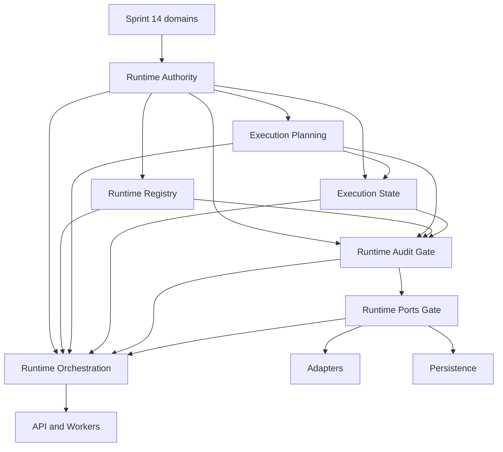

 Runtime Architecture Roadmap

## 1. Role of the runtime

The Sprint 15 runtime is the governed boundary between immutable policy-decision metadata and a
future side effect. It preserves exact authority, planning, state, action, audit, isolation, and
provenance facts while ensuring that possession of an upstream record never silently becomes
permission or execution.

The runtime does not decide policy correctness. DecisionPipeline is not an execution command,
ReleaseGate is not a permit, ExecutionPlan is not execution, execution state is not authority
state, and execution result is not a policy outcome.

## 2. Current and target state

### Current state - CP9 Runtime API complete

- `app.runtime.authority`: immutable request, authority reference, permit reference, admission,
  revocation, bundle, audit-metadata, and pure validation contracts.
- `app.runtime.planning`: immutable metadata-only plans, steps, dependency graph, bindings,
  retry/timeout metadata, compensation references, validation records, and pure validation.
- `app.runtime.state`: immutable explicit transition request/decision/record contracts,
  optimistic revisions, append-only history, terminal states, and pure validation.
- `app.runtime.registry`: immutable action definitions, lifecycle entries, tenant/organization-bound
  snapshots, exact resolution facts, side-effect requirements, and pure validation.
- `app.runtime.audit`: immutable append-only safe event and trail contracts with pure validation.
- `app.runtime.ports`: implementation-neutral adapter, repository, transaction, initial outbox,
  clock, cancellation, and credential-broker Protocols and immutable boundary contracts.
- `app.runtime.orchestration`: governed one-call invocation and caller-supplied atomic outcome
  coordination through Ports only.
- `app.runtime.adapters`: deterministic fake and dry-run implementations with no external effect.
- `app.runtime.persistence`: PostgreSQL repositories, optimistic append, initial outbox storage,
  and local atomic State, Audit, Idempotency, and optional enqueue commit.
- CP7 Acceptance proves the Request-to-read-back vertical slice with the production Fake Adapter
  and PostgreSQL without changing production behavior.
- CP8 PostgreSQL Delivery Persistence merged in PR #53, Lifecycle Port conformance in PR #54,
  and governed Delivery Orchestration in PR #55.
- PR #56 corrected Alembic 0007 asyncpg execution, and PR #57 corrected repeated lifecycle
  projection cardinality. PR #65 merged the definition-only Runtime permissions, PR #66 merged
  grant/revoke governance, and PR #67 merged governed grant provisioning. The current migration
  head is `20260808_0024`.
- The CP8 Runtime Delivery Acceptance Gate passed PostgreSQL 16 verification and green CI and
  merged in PR #58. CP8 Runtime Delivery is complete within its approved local delivery boundary.
- CP9 production composition and three thin Runtime routes merged in PR #120. The combined
  PostgreSQL 16 and HTTP acceptance gate merged in PR #121 with exact replay, independent rate
  admission, facade transaction, rollback, and managed-lifecycle evidence. CP9 Runtime API is
  complete within this approved boundary.
- CP10 Worker governance, public contracts, trusted preparation, production composition, bounded
  poll/drain correction, and PostgreSQL shutdown/crash-window acceptance merged through PR #144.
  The delivery-only Worker consumes persisted governed work without adding migration
  `20260808_0025`, a Worker registry, scheduling authority, or external-effect exactly-once.

### Target state - Sprint 15 complete

CP0 through CP10 are complete within their merged Sprint 15 boundaries. Real external adapters,
live credential resolution, queue infrastructure, autonomous scheduling, generalized retries, and
external business-effect exactly-once remain separate future work. The CP10 Worker is bounded to
governed persisted delivery facts and does not infer policy, retry, reconciliation, or authority.

## 3. Program sequence versus dependency order

The fixed delivery sequence is CP0 Architecture, CP1 Authority, CP2 Planning, CP3 State, CP4
Registry, CP5 Orchestration, CP6 Adapters, CP7 Persistence, CP8 Outbox, CP9 API, and CP10 Workers.

The architecture dependency order is different. State consumes Planning and Authority;
Orchestration consumes Registry, Planning, State, Audit and Ports; Adapters implement Ports;
Persistence implements repository/outbox-storage Ports; and API/Workers call the
application/orchestration boundary. Because CP2 and CP3 preceded the CP4 registry implementation,
CP4 defines independent registry contracts with action identity, version, registry revision,
schema reference, and selector shapes that are structurally and semantically compatible with the
opaque references already recorded by CP2. Registry production code imports neither Planning nor
State and does not consume `ExecutionPlan` objects. Actual plan-to-registry binding validation is
downstream of Registry, Planning and State in an approved application/orchestration boundary.
Changing Planning to import Registry requires separately approved scope and regression review;
CP2 and CP3 public contracts remain unchanged.

ADR-077 fixes Audit and Ports as separate prerequisite gates before CP5. CP5-Gate-Audit is first;
CP5-Gate-Ports begins only after Audit merges. These gates do not renumber CP5 through CP10.
ADR-083 adds a narrow CP7-Gate-Commit-Facts prerequisite without renumbering CP7. It supplies
caller-bound receipt and digest facts and an injected-clock reference before Persistence begins.
ADR-085 adds `CP8-Gate-Delivery-Contracts` without renumbering CP8. It resolves package placement
and external-effect semantics and merged in PR #50. ADR-086 adds the additive
`CP8-Gate-Delivery-Persistence-Contracts`, which merged in PR #52 before PostgreSQL delivery
Persistence implementation began.

## 4. Dependency view



Arrows mean "is an input contract or required boundary for," not authority delegation. No arrow
grants permission or causes automatic execution.

## 5. CP0-CP10 roadmap

| CP | Status | Layer or decision | Primary output | Principal gate |
| --- | --- | --- | --- | --- |
| CP0 | Merged | Architecture | ADR-065 through ADR-072 and normative rules | No runtime package created by CP0 |
| CP1 | Merged | Authority | Immutable authority bundle and validation | No issuance or execution |
| CP2 | Merged | Planning | Immutable plans and validation records | Plan remains inert |
| CP3 | Merged | State | Explicit append-only transition metadata | No automatic progress |
| CP4 | Merged | Registry | Action definitions and immutable snapshots | No executable registration |
| CP5-Gate-Audit | Merged | Audit | Safe append-only event contracts | Audit is not authority |
| CP5-Gate-Ports | Merged | Ports | Adapter/repository/outbox/clock/broker protocols | Protocols have no implementation |
| CP5 | Merged | Orchestration | Pure governed coordination | Requires Registry, Audit, and Ports |
| CP6 | Merged | Adapters | Deterministic fake and dry-run adapters | No external effect or credential resolution |
| CP7-Gate-Commit-Facts | Merged | Ports receipt provenance | Caller-bound receipts, digest and clock reference | No hidden generation |
| CP7 | Merged | Persistence | Repositories, migrations, local transactions | Storage owns no policy |
| CP7-Acceptance | Merged | PostgreSQL vertical evidence | Atomic commit and exact read-back | PostgreSQL pass required |
| CP8-Gate-Delivery-Contracts | Merged, PR #50 | Delivery contracts | Effect lifecycle and reconciliation contracts | No external delivery |
| CP8-Gate-Delivery-Persistence-Contracts | Merged, PR #52 | Persistence boundary | Atomic effect facts and lifecycle receipts | Contracts precede implementation |
| CP8 PostgreSQL Delivery Persistence | Merged, PR #53 | Persistence | Four-table storage, replay, due selection and lifecycle CAS | Storage owns no policy |
| CP8 Lifecycle Port conformance | Merged, PR #54 | Persistence conformance | `append(request)` alignment | No schema change |
| CP8 Runtime Delivery Orchestration | Merged, PR #55 | Orchestration | Governed delivery and reconciliation | Ports only |
| CP8 Runtime Delivery Acceptance Gate | Merged, PR #58 | Vertical evidence | PostgreSQL crash-window scenarios | No external exactly-once claim |
| CP8 closeout | Merged, PR #59 | Governance closeout | CP8 completion evidence | No Worker, queue, API, or `app.runtime.outbox` |
| CP8 | Merged | Effect delivery | Local atomic delivery and reconciliation boundary | External exactly-once is not guaranteed |
| CP9 Governance / ADR-087 | Merged, PR #60 | API boundary | Principal, RBAC, threat and placement decisions | No production route |
| CP9-Gate-API-Contracts | Merged, PR #61 | API contracts | Immutable principal, scope, facade, idempotency and safe error contracts | Contracts do not create a production API |
| CP9-Gate-Auth-Claims | Merged, PR #62 | Authentication trust | Required issuer/audience, HS256-only zero-leeway verification, immutable verified claims, legacy-token rejection and generic bearer failures | Focused authentication regression complete |
| CP9-Gate-Tenant-Organization-Binding-Governance | Merged, PR #63 | Binding governance | Lifetime one-to-one cardinality, explicit provisioning, immutable classification ceiling, no rebinding or privileged bypass, and fail-closed downgrade | Governance baseline only |
| CP9-Gate-Tenant-Organization-Binding | Merged, PR #64 | Binding persistence | Lifetime one-to-one model, explicit persistence, self-contained migration `20260807_0018`, fail-closed downgrade, trusted resolver, and PostgreSQL 16 verification | No production Runtime route or provisioning surface |
| CP9-Gate-Runtime-Permission-Definitions | Merged, PR #65 | RBAC definitions | Definition-only persistence of exact `runtime.read`, `runtime.invoke`, and `runtime.reconcile` permissions in migration `20260807_0019` | No automatic grants or existing role/membership backfill |
| CP9-Gate-Runtime-Grant-Governance | Merged, PR #66 | RBAC grant governance | ADR-088 fixes exact management authority, immutable append-only ledger, replay, scope, and transaction semantics | Governance precedes production provisioning |
| CP9-Gate-Runtime-Grant-Provisioning | Merged, PR #67 | RBAC grant persistence | Atomic projection and append-only ledger, exact replay, scoped authority revalidation, concurrency, and PostgreSQL 16 evidence | Automatic management grants remain zero |
| CP9-Gate-Runtime-Permission-Fact-Resolver-Governance | Merged, PR #69 | RBAC resolution governance | ADR-089 fixes server-owned operation mapping, live projection authority, non-disclosure, and revocation linearization | Governance baseline; no facade or route |
| CP9-Gate-Runtime-Permission-Fact-Resolver | Merged, PR #70 | RBAC resolution | Transaction-bound SQLAlchemy resolution of exact live `RolePermission` facts | No cache, migration, facade, route, or transport |
| CP9-Gate-Transport-Idempotency-Governance | Merged, PR #71 | Mutation replay governance | ADR-090 fixes scoped identity, explicit command version, canonical digest, immutable receipts, and transaction linearization | Migration `0021` is planned only |
| CP9-Gate-Transport-Idempotency-Contracts | Merged, PR #72 | Mutation replay contracts | Adds bounded command version, explicit commit facts, atomic commit protocol, and exact replay equality | No persistence, migration, facade, or route |
| CP9-Gate-Transport-Idempotency-Atomic-Commit-Contract-Correction | Merged, PR #73 | Mutation callback ordering | Requires lock and replay/conflict resolution before invoking one bounded local mutation | No facade or route |
| CP9-Transport-Idempotency | Merged, PR #74 | Mutation replay persistence | Immutable `runtime_api_idempotency_receipts`, migration `20260808_0021`, and caller-owned transaction service | Facade and routes remain blocked |
| CP9-Gate-Trusted-Application-Facade-Governance | Merged, PR #75 | Facade trust boundary | ADR-091 fixes transaction ownership, trusted fact binding, canonical digest construction, and safe errors | Governance only; no facade or route |
| CP9-Gate-Trusted-Application-Facade-Contracts | Merged, PR #76 | Facade contracts | Transport-safe inputs, verified claims, organization selector, explicit server facts, exact permissions, and canonical digests | No production facade or route |
| CP9-Gate-Trusted-Application-Facade-Fact-Binding-Contracts | Merged, PR #77 | Fact-binding contracts | Explicit trusted-context facts, clock-free resolver input, orchestration binder Protocol, and local-operation Protocol | No concrete binder, facade, or route |
| CP9-Trusted-Application-Facade | Merged, PR #78 | Production facade | One SQLAlchemy transaction binds trusted context, exact permission, canonical digest, idempotency, and a bounded local operation | Concrete binder/local-operation implementation and routes remain blocked |
| CP9-Gate-Local-Fact-Binding-and-Transaction-Integration-Governance | Merged, PR #79 | Local integration governance | ADR-092 fixes exact persisted orchestration facts, Registry snapshot provenance, and active-transaction Persistence boundaries | Governance only |
| CP9-Gate-Local-Fact-Binding-and-Active-Transaction-Persistence-Contracts | Merged, PR #80 | Local integration contracts | Adds exact persisted record, permit, Registry, scope, lineage, operation-binding, and caller-owned active-transaction Ports contracts | No concrete binder, store, migration, or route |
| CP9-Gate-Registry-Resolution-and-Admission-Exactness-Contracts | Merged, PR #81 | Exactness contract correction | Binds persisted Registry snapshot/reference, resolution request/decision, and admission decision identities and scope fail closed | No Registry snapshot persistence, concrete binder/local operation, migration, or route |
| CP9-Gate-Registry-Snapshot-Persistence-and-Active-Transaction-Integration-Governance | Merged, PR #82 | Persistence and transaction governance | ADR-093 requires a separate append-only Registry store, migration `20260808_0022`, exact admission binding, and caller-session participation | Governance only |
| CP9-Gate-Active-Transaction-Write-Set-and-Session-Binding-Governance | Merged, PR #83 | Atomic local persistence governance | ADR-094 selects existing closed atomic/reconciliation payloads, rejects marker staging, and requires one-shot exact session/root-transaction binding | Governance only |
| CP9 Active-Transaction Public Contracts | Merged, PR #84 | Atomic local persistence contracts | Closed operation-matched write sets and an exact transaction-bound factory | No route or schema change |
| CP9-Gate-Reconciliation-Request-Persistence-Ownership-and-Atomic-Integration-Sequencing | Merged, PR #85 | Reconciliation persistence governance | ADR-095 assigns the strict reconciliation request to dedicated append-only Persistence | Governance only |
| CP9 Registry/Reconciliation Persistence and One-Shot Active Transaction | Merged, PR #86 | Persistence implementation | Migration `20260808_0022`, seven append-only tables, exact repositories, and caller-session/root staging | No facade or route |
| CP9-Gate-Explicit-Integration-Facts-and-Request-Scoped-Persistence-Binding | Merged, PR #87 | Concrete integration governance | ADR-096 preserves five-parameter facade methods and exact request-scoped binding | Governance only |
| CP9 Explicit Integration Facts Public Contracts | Merged, PR #88 | Contract amendment | Required strict operation integration facts and request-scoped provider Protocol | No production integration |
| CP9-Gate-Authoritative-Result-and-Query-Projection-Ownership | Merged, PR #89 | Result/projection governance | ADR-097 fixes mutation-result, replay-result, and query-projection ownership | Governance only |
| CP9-Gate-Runtime-Lifecycle-and-Public-Projection-Domain-Governance | Merged, PR #90 | Lifecycle projection governance | ADR-098 defines total public-status mapping, result cardinality, and exact locator authority | Governance only |
| CP9-Gate-Runtime-Lifecycle-Public-Contracts | Merged, PR #91 | Public lifecycle contracts | Approved statuses, immutable total mapping, and strict cardinality validation | No persistence change |
| CP9-Gate-Exact-Query-Locator-and-State-Revision-Read-Contracts | Merged, PR #92 | Exact projection read contracts | Adds closed query-only locators and an exact state-revision read result exposing the stored digest | Repository implementation and concrete integration remain deferred |
| CP9-Gate-Authoritative-Domain-Operation-Result-Contracts | Merged, PR #93 | Mutation result contracts | Binds one immutable safe result and approved closed local stage as sibling output | No external effect |
| CP9-Gate-Logical-Execution-Result-Ownership | Merged, PR #94 and PR #95 | Logical-result governance | ADR-099 and its correction separate API logical results from action-level adapter results | Governance only |
| CP9 Logical Execution-Result Public Contracts | Merged, PR #96 | Result persistence contracts | Exact logical-result identity, revision, locator, and read contracts | No route |
| CP9 Logical Execution-Result Persistence and Exact Reads | Merged, PR #97 | Result persistence | Migration `20260808_0023`, append-only persistence, and exact revision reads | No external effect |
| CP9 Application Integration | Merged, PR #98 | Concrete application composition | Adds a request-scoped one-shot facts provider, pure binder, domain-callback local operation, exact binding/state/result reads, and same-transaction staging through the existing facade | Production routes and CP9 closeout remain separate |
| CP9-Gate-Runtime-Route-Trusted-Preparation-and-Production-Composition | Merged, PR #99 | Route and composition governance | ADR-100 fixes header-only idempotency, server-owned preparation, thin routes, and bounded errors | Governance only |
| CP9 Runtime Route Transport and Preparation Contracts | Merged, PR #100 | Transport contracts | Header-only idempotency and strict trusted preparation carriage | No production route |
| CP9 Preparation Provenance Governance and Contracts | Merged, PR #101 and PR #102 | Preparation authority | ADR-101 provenance plus exact operational capability contracts | Request-local only |
| CP9 Preparation Producer Governance and Contracts | Merged, PR #103 and PR #104 | Production capability boundary | ADR-102 producer/backend ownership and public factory contracts | No route |
| CP9 Rate-Admission Governance and Contracts | Merged, PR #105 and PR #106 | Rate policy boundary | ADR-103 fixed-window semantics and immutable public contracts | No default policy |
| CP9 Rate-Policy Permission Governance | Merged, PR #107 | Permission authority | ADR-104 fixes definition ID, grant authority, and zero automatic grants | Governance only |
| CP9 Rate-Admission Persistence | Merged, PR #108 | Rate persistence | Migration `20260808_0024`, definition-only permission, four append-only tables, and PostgreSQL evidence | No route |
| CP9-Gate-Operational-Preflight-and-Preparation-Consumption-Governance | Merged, PR #109 | Preflight ordering governance | ADR-105 fixes closed operational inputs, non-consuming inspection, terminal rejection, and consume-after-success ordering | Governance only; public contracts and production remain separate |
| CP9 Operational Preflight and Preparation Consumption Public Contracts | Merged, PR #110 | Application public contracts | Closed exact preflight and distinct inspect/consume/reject Protocols | No migration `0025` |
| CP9 Production Preparation Injection Governance | Merged, PR #111 | Composition ownership | ADR-106 immutable application injection and request-local lifetimes | Governance only |
| CP9 Dependency-Bundle Governance and Correction | Merged, PR #112 and PR #113 | Factory graph | ADR-107 factory graph, exact signatures, and non-suppressing async disposal | Governance only |
| CP9 Dependency-Bundle and Upstream Public Contracts | Merged, PR #114 | Composition contracts | One scope-factory bundle and transport-neutral observer Protocols | No route |
| CP9 Managed Request-Capability Governance and Contracts | Merged, PR #115 and PR #116 | Managed lifetime | ADR-108 and covariant managed-resource Protocols | No migration `0025` |
| CP9 Organization Selector and HTTP Semantics Governance | Merged, PR #117 | Transport semantics | ADR-109 canonical selector and bounded operational rejection mapping | Governance only |
| CP9 Required-Audience Governance and Config Contracts | Merged, PR #118 and PR #119 | Authentication configuration | ADR-110 and strict immutable required-audience configuration | No schema change |
| CP9 Production Runtime Composition and Thin Routes | Merged, PR #120 | Production API | Immutable dependency injection and exactly three thin Runtime routes | No Worker or external effect |
| CP9 Combined PostgreSQL and HTTP Acceptance | Merged, PR #121 | Vertical acceptance | Real managed preparation, rate transaction, facade transaction, replay, rollback, and HTTP evidence | No migration `0025` |
| CP9 closeout | Merged | Governance closeout | CP9 completion evidence and stale-status rejection | CP10 remains separately governed |
| CP9 | Merged | API | Governed production Runtime API within the approved CP9 boundary | No Worker, queue, scheduler, or external business effect |
| CP10 Worker Governance and Public Contracts | Merged, PR #123 through PR #140 | Worker governance and contracts | ADR-111 through ADR-121, exact prepared delivery, request preparation, result production, revalidation, shutdown observation, and operational-failure contracts | No migration `0025` |
| CP10 Production Worker and Ordering Correction | Merged, PR #141 through PR #143 | Production Worker | Bounded delivery-only application service with non-blocking poll results and sticky shutdown drain | No scheduler or inferred retry |
| CP10 PostgreSQL Shutdown/Crash-Window Acceptance | Merged, PR #144 | PostgreSQL evidence | Concurrent claim serialization, exact replay, durable `DELIVERING` exclusion, and zero-residue bounded drain | Test-only; no schema change |
| CP10 closeout | Merged | Governance closeout | Combined CP8/CP9/CP10 regression and authoritative Sprint 15 completion state | No tag or release |
| CP10 | Merged | Workers | Governed persisted-work delivery consumer | No inferred policy, hidden retry, or external exactly-once claim |

CP9 Governance began in PR #60 and its sequenced governance, contracts, persistence, application,
production-route, and acceptance gates are merged through PR #121. Routes remain in `app.api`;
`app.runtime.api` and `app.runtime.outbox` remain prohibited. The migration head is
`20260808_0024`. CP9 is complete within its approved Runtime API boundary, CP10 Workers remain
Planned, and external business-effect exactly-once remains unguaranteed. Blind retry and automatic
redrive remain prohibited.

The completed implementation order was:

1. Merge ADR-092 local integration governance.
2. Merge additive binding and active-transaction Persistence contracts (PR #80).
3. Merge the Registry resolution and admission exactness contract correction gate (PR #81).
4. Merge ADR-093 Registry snapshot persistence and active-transaction integration governance.
5. Merge ADR-094 write-set and caller-session binding governance and its public-contract gate.
6. Merge ADR-095 reconciliation-request persistence ownership and atomic-integration sequencing.
7. Implement migration `20260808_0022`, the separate Registry store, dedicated
   reconciliation-request store, and active-transaction
   persistence in their approved checkpoint.
8. Implement the concrete binder and local operation in a separate checkpoint.
9. Implement production Runtime routes.
10. Run combined CP9 PostgreSQL and HTTP acceptance.
11. Complete CP9 closeout.
12. Begin CP10 only after separate approval.

Steps 1 through 11 are merged through PR #121 and this closeout. Step 12 remains gated by separate
CP10 governance and explicit approval.

### CP9 Runtime route trusted preparation and production composition

ADR-100 governs the remaining transport boundary after Application Integration merged in PR #98.
Mutation idempotency comes only from one bounded `Idempotency-Key` header; mutation body schemas
cannot duplicate it. A server-owned request-scoped preparation source returns one exact inert
operation package from approved command/orchestration preparation output. HTTP, routes, generic
dependency injection, Persistence, and current/latest lookup cannot generate or infer its UUIDs,
times, revisions, digests, write set, logical result, Registry, admission, permit, State, Audit, or
lineage facts.

The route checkpoint remains split into a narrow transport/preparation contract amendment and a
later production composition/route implementation. The facade retains five parameters and owns the
only `AsyncSession` root transaction. No migration `20260808_0024` is approved. PostgreSQL/HTTP
acceptance and CP9 closeout remain blocked until both gates merge; CP10 remains Planned.


## 6. Boundary input and output contracts

### Authority

- **Inputs:** Exact execution subject and request, external review/approval/authorization facts,
  bounded external permit facts, revocations, identities, selectors, revisions and lineage.
- **Outputs:** Validated immutable authority bundle and admission decision metadata.
- **Never outputs:** Approval, authorization, permit issuance, execution, state, or result.

### Planning

- **Inputs:** Admitted authority bundle, exact DecisionPipeline identity, caller-supplied action and
  registry references, steps, dependency and binding metadata.
- **Outputs:** Immutable validated plan and validation records.
- **Never outputs:** Registry discovery, adapter invocation, authority, state transition, or I/O.

### State

- **Inputs:** Exact authority/plan references, transition request, transition decision, optimistic
  revision, idempotency key, attempt, scope, lineage and timestamps.
- **Outputs:** Append-only transition record and validated immutable state history.
- **Never outputs:** Authority, automatic lifecycle progress, retry execution, cancellation,
  compensation, persistence, or a policy outcome.

### Registry

- **Inputs:** Governed action identity/version, schema references, capabilities, risk,
  side-effect level, permit/destination/idempotency/retry/compensation rules, adapter reference,
  registry snapshot identity and revision.
- **Outputs:** Immutable canonical action definitions and snapshot resolution facts.
- **Never outputs:** Callback, executable import, credential, permit, policy decision, adapter
  invocation, or runtime self-registration.

### Audit

- **Inputs:** Safe bounded facts from authority-relevant transitions and side-effect lifecycle.
- **Outputs:** Append-only immutable event contracts with exact scope and provenance references.
- **Never outputs:** Authorization, correctness, payload transport, or unrestricted content.

### Ports

- **Inputs/outputs:** Typed protocols for adapter invocation, bounded results/errors, repositories,
  transactions, outbox, clock, cancellation and tenant-scoped credential resolution.
- **Never outputs:** Implementation, default provider, global credential, or policy decision.

### Orchestration

- **Inputs:** Validated authority, registry, plan, state and audit contracts plus port protocols.
- **Outputs:** Explicit requests and coordination results over supplied facts.
- **Never outputs:** Invented authority, direct external call, implicit transition, retry,
  cancellation, compensation, or correctness claim.

### Adapters

- **Inputs:** Fully validated invocation envelope, exact permit and registry binding, READY or
  RUNNING state, idempotency/attempt metadata, destination and tenant credential reference.
- **Outputs:** Bounded result/artifact references or typed errors.
- **Never outputs:** Policy, permit, state mutation, API response, unrestricted provider payload,
  or stored credential.

### Persistence and outbox

- **Inputs:** Validated runtime facts and application-boundary commands.
- **Outputs:** Repository facts, optimistic revision/uniqueness outcomes, atomic local transaction
  records, delivery attempts, dead-letter and reconciliation facts.
- **Never outputs:** Policy decisions, external atomicity, inferred success, or direct authority.

### API and workers

- **Inputs:** Authenticated/scoped API commands or persisted governed work.
- **Outputs:** Calls to and bounded responses from the runtime application boundary; recorded
  worker attempts.
- **Never outputs:** Direct adapter/repository bypass, inferred authority, secrets, or raw payloads.
- **Placement:** CP9 routes remain in the existing `app.api` layer and workers remain external
  application/infrastructure entry points. Dedicated `app.runtime.api` or `app.runtime.workers`
  packages require a separately approved superseding ADR.

## 7. Registry binding model

The Action Registry connects intent to an enumerable execution boundary:

```text
action identity and version
  -> required permit rules
  -> risk profile and side-effect classification
  -> input/output schema references
  -> destination and idempotency requirements
  -> retry and compensation eligibility
  -> adapter identity and version reference
  -> optional provider/model/tool/connector selectors
  -> immutable registry snapshot and revision
```

The registry declares this relationship but executes nothing. Adapter selection does not grant
authority. Unknown, disabled, substituted, or revision-mismatched actions fail closed.

## 8. Unified selector policy

Model, provider, connector, MCP, internal action, repository operation, and other adapter families
use the same policy comparison dimensions where applicable:

- tenant and organization;
- actor, agent instance, and represented user;
- resource, action, purpose, and risk level;
- classification and execution environment;
- destination;
- model, provider, tool, and connector identifiers;
- request, plan, step, attempt and idempotency identities;
- policy, authorization and registry revisions;
- lineage and provenance references;
- permit validity, revocation, invocation and attempt bounds.

An omitted applicable selector fails closed. A later boundary cannot broaden, substitute, infer,
or lower any selector. Specialized one-request MCP permits and replay-protected repository permits
remain authoritative and are not replaced by a broader runtime permit.

## 9. Fake and dry-run first

CP6 starts with fake and dry-run model, provider, MCP, connector, and approved external/internal
action adapters implementing the exact approved ports. Repository and transaction/outbox-storage
port implementations belong to CP7 Persistence and are not adapter families. Adapters do not call
repositories or bypass State or the application/policy boundary. Fake adapters provide
deterministic test references without external I/O. Dry-run adapters perform no side
effect and create no authority; dry-run success is not admission, permit validity, or evidence of
future execution success. Real adapters require separate enablement, threat review, destination
controls, tenant-bound credential resolution and immediate permit revalidation.

## 10. Persistence and transaction boundary

Repository interfaces live in Ports; implementations live in Persistence. Repositories store and
retrieve validated facts and enforce tenant-partitioned uniqueness and optimistic revisions. They
do not approve, authorize, issue permits, select actions, progress state, retry work, or invoke
adapters.

Where supported, state change, audit event, idempotency reservation and outbox record commit in
one local transaction. External side effects are never claimed transactionally atomic with local
storage. Migration ownership belongs to runtime persistence. ADR-083 selects PostgreSQL 16,
SQLAlchemy 2 asynchronous Sessions, explicit transaction ownership, logical tenant partitioning,
and preservation-only retention for CP7. CP7 performs no purge; physical partitioning and any
destructive retention schedule require later operational evidence and approval.

Repository write requests carry their exact receipt identifiers. Atomic write sets carry typed
record receipt facts, a transaction receipt identifier, a transaction digest reference, and an
injected clock reference. Persistence echoes and stores those facts and observes commit time from
the named clock Port; it does not invent identifiers, digests, State, Audit, Idempotency, or
Outbox facts. ADR-084 samples and validates that injected clock at the commit boundary so the exact
reading is part of the database transaction, then publishes the receipt only after commit succeeds.

## 11. Outbox, idempotency and reconciliation

ADR-085 resolves R15-07 without creating `app.runtime.outbox`. Immutable delivery contracts and
Protocols extend `app.runtime.ports`; PostgreSQL storage extends `app.runtime.persistence`; and
governed delivery behavior extends the existing `app.runtime.orchestration` application boundary.
Adapters remain the only Runtime implementations that perform approved external effects. Future
CP10 Workers call Orchestration and never access Persistence, repositories, credential brokers, or
adapters directly.

`CP8-Gate-Delivery-Contracts` merged in PR #50 with the effect identity, reference-only delivery
envelope, closed lifecycle, claim, lease, attempt, retry, dead-letter, reconciliation, Protocol,
pure-validation, and architecture-test surface. It created no SQLAlchemy model, migration,
dispatcher, queue, Worker, API, network call, retry loop, or external effect.

ADR-086 fixes the PostgreSQL baseline, and `CP8-Gate-Delivery-Persistence-Contracts` merged in PR
#52. PostgreSQL Delivery Persistence merged in PR #53, Lifecycle Port conformance in PR #54, and
governed Delivery Orchestration in PR #55. Migration `20260805_0016_runtime_effect_delivery.py` creates
exactly `runtime_effects`, `runtime_effect_lifecycle_heads`,
`runtime_effect_lifecycle_revisions`, and `runtime_effect_reconciliation_observations`. Dedicated
claim, attempt, result, retry, and dead-letter tables remain deferred pending an approved
independent lookup or retention need.

PostgreSQL 16.14 verification passed: scenarios 12 passed; focused 2 passed; combined CP8 and CP7
PostgreSQL 22 passed; Ports, Delivery, and Architecture 46 passed; order A 177 passed with skip 0;
order B 177 passed with skip 0; and migration upgrade, downgrade, and parity checks passed.

PR #56 corrected Alembic 0007 asyncpg execution, PR #57 added lifecycle projection cardinality,
and Runtime grant provisioning migration `20260808_0020` precedes the current `20260808_0021` head. PR #58 merged the PostgreSQL
crash-window and vertical Acceptance Gate with green CI, completing CP8 Runtime Delivery. No
`app.runtime.outbox`, Worker, queue, polling loop, scheduler, or API is introduced, and external
exactly-once business effects are not guaranteed.

- Effect-level idempotency uses one caller-supplied stable effect identity across attempts. Its
  tenant, organization, request, plan step, action, destination, payload reference and digest,
  classification, lineage, and idempotency key cannot change. Attempt identity is explicitly
  excluded from effect-level uniqueness.
- Identical replay may return the recorded effect or result reference; mismatched effect or
  idempotency reuse fails closed.
- The local initial enqueue, State, Audit, and attempt-level Idempotency facts commit atomically.
  PostgreSQL uniqueness and optimistic revisions protect local effects and lifecycle facts.
- External effects are not transactionally atomic with PostgreSQL. PolicyOS makes no global
  exactly-once business-effect claim and uses no distributed or two-phase commit.
- Delivery is evidence-aware. A definitely-not-delivered failure may enter a bounded governed
  retry path; acknowledgement loss or unknown destination state becomes explicit ambiguity and
  does not retry automatically.
- Retry is explicit, action-eligible, attempt-bounded, eligible-time-bound, and uses a new governed
  attempt with fresh authority, permit, cancellation, deadline, and credential validation.
  Publication, deployment, destructive, quarantine, legal-hold, access-control, credential, and
  security-control actions do not retry automatically.
- One effect has at most one active unexpired local claim. A claim or lease is concurrency metadata
  and grants no authority, permit, credential, retry, or effect permission.
- Dead-letter records are terminal append-only facts with safe bounded failure and attempt
  references. CP8 performs no automatic redrive.
- Reconciliation records only confirmed delivered, confirmed not delivered, still ambiguous, or
  observation unavailable. It compares authorized external observations with immutable local
  evidence and never invents success.
- Cancellation is a distinct action/state transition and is not rollback. Compensation is a
  separately registered action with separate authorization and permit and is not guaranteed
  rollback.

## 12. API and worker authority limits

The API authenticates, validates transport schemas and invokes the runtime application boundary.
Runtime routes remain in the existing `app.api` layer; CP9 does not create `app.runtime.api`
without a separately approved superseding ADR. It does not own authority, call adapters, mutate
state directly, expose secrets, or access
repositories to bypass policy.

Workers are external application/infrastructure entry points, not `app.runtime` domain packages.
CP10 does not create `app.runtime.workers` without a separately approved superseding ADR. Worker
package placement, queue, lease, scheduling, and identity are decided before implementation.
Workers consume only persisted governed work. They use scoped worker identity, revalidate tenant,
organization, registry, authority and permit, call the orchestration/ports boundary, and record
attempts. They do not infer missing policy, bypass isolation, call adapters directly, or perform
hidden retry/cancellation/compensation.

## 13. Threats and defenses by checkpoint

| CP | Primary threat | Required defense |
| --- | --- | --- |
| CP0 | Ambiguous ownership or reverse dependency | Frozen layers, normative rules, dependency guards |
| CP1 | Intent treated as authority or permit broadened | Separate facts, exact scope, bounded permit validation |
| CP2 | Plan treated as execution or authority expanded | Inert metadata, exact bindings, acyclic canonical graph |
| CP3 | State treated as authority or advanced automatically | Explicit request/decision/record, optimistic revision, terminal history |
| CP4 | Arbitrary executable registration | Immutable snapshots, no callbacks/import paths, fail-closed resolution |
| CP5 gates | Audit or ports acquire policy/implementation | Safe events and protocol-only contracts |
| CP5 | Orchestrator bypasses authority or calls external systems | Pure coordination, explicit requests, ports only |
| CP6 | Adapter chooses policy, leaks credentials, or redirects | Validated envelope, brokered credentials, exact destination and permit |
| CP7 | Repository advances state or crosses tenants | Contract tests, transaction boundary, partitioned uniqueness |
| CP8 | Duplicate/unbounded effects or invented success | Idempotency, bounded retry, dead-letter and reconciliation |
| CP9 | Route bypasses runtime or exposes sensitive data | Authentication/RBAC, thin transport, safe schemas/errors |
| CP10 | Worker infers authority or silently repeats work | Persisted governed work, lease/attempt records, revalidation |

## 14. Capabilities not yet implemented

The following are Planned or Decision required, not current capabilities: tenant credential
broker implementation, real model/provider/MCP/connector calls, runtime repositories, migrations,
transaction manager, persistence I/O, outbox dispatch, dead-letter processing, reconciliation
jobs, runtime API, workers, queues, schedulers, live cancellation, compensation execution,
operational retries, and external effects. Existing fake and dry-run adapters perform no external
effect.

## 15. CP5 prerequisite-gate plan

- Merge ADR-077 and the corrected `AGENTS.md` dependency summary first.
- Implement CP5-Gate-Audit on a dedicated branch and PR with its own implementation ADR.
- Keep Audit immutable, append-only, safe, deterministic, and free of authority or transport.
- Merge Audit with green CI before opening the Ports implementation gate.
- Implement CP5-Gate-Ports on a separate branch and PR with its own implementation ADR.
- Keep Ports protocol-only and free of Orchestration or infrastructure implementations.
- Continue prohibiting `app.runtime.orchestration` until both gates merge independently.
- Define the application-boundary contract in the CP5 implementation ADR before orchestration.

## 16. Preparation after CP10

Before Sprint 15 Final Review, integrate architecture, security, migration, transaction, adapter,
outbox, API and worker test evidence; verify operational recovery, dead-letter and reconciliation;
review tenant/classification/retention controls; update runbooks; resolve or formally defer open
decisions; and make a separate project release-version decision. A Git tag, production enablement,
or release publication is not implied.

## 17. Deferred to Sprint 16 or later

- General-purpose runtime plugin or dynamic action ecosystems.
- Automatic policy synthesis, approval, permit issuance, or action discovery.
- Cross-tenant/global fallback execution.
- Unbounded autonomous retry, remediation, cancellation or compensation.
- Exactly-once external business-effect guarantees.
- Provider-specific optimization not expressed through governed ports.
- Broader UI/operations experiences beyond the reviewed Runtime API and worker boundaries.
- Any new runtime layer not explicitly approved after Sprint 15 Final Review.

## 18. Governance decisions and remaining downstream work

ADR-077 and the corrected operating rule resolve the CP5 dependency-order and review-unit
decisions. ADR-065 remains canonical: Registry, Audit, and Ports are inputs to Orchestration;
Planning and Registry remain independent under ADR-076. Audit and Ports are separate prerequisite
gates and each requires its own implementation ADR and merged PR.

ADR-078, ADR-079, and ADR-081 define the merged Audit, Ports, and Orchestration surfaces. ADR-085
resolves CP8 package placement and external-effect semantics: Ports own contracts, Persistence owns
storage, Orchestration owns governed delivery coordination, Adapters own exact effects, and no
`app.runtime.outbox` package is approved. The delivery-contract gate merged in PR #50. ADR-086
blocks CP8 production implementation until `CP8-Gate-Delivery-Persistence-Contracts` merges with
green CI. CP9 routes remain in `app.api`, and Workers remain external entry points unless
superseding ADRs approve different placement. Roadmap documentation does not resolve or supersede
those later decisions.

CP9-Gate-Runtime-Permission-Definitions merged in PR #65, grant governance merged in PR #66, and
governed grant provisioning merged in PR #67, permission-fact resolver governance merged in PR #69,
and the resolver merged in PR #70. CP9 Runtime API remains Planned / Blocked pending transport
idempotency persistence, the trusted application facade, and production routes. CP10 remains
Planned.

ADR-089 proposes live permission-fact resolution from the current `RolePermission` projection,
server-owned operation-to-permission mapping, per-operation resolution without caches, and a shared
transaction boundary that linearizes local requests with grant and revoke commits. The governance
gate and resolver are merged; no facade or route is added.

ADR-090 proposes mutation-only transport replay using a trusted scoped identity, explicit
`command_version`, canonical digest, transaction-scoped PostgreSQL advisory lock, and immutable
bounded receipt. Migration `20260808_0021_runtime_api_idempotency.py` is planned only and does not
exist in this governance gate.

ADR-090 governance merged in PR #71. `CP9-Gate-Transport-Idempotency-Contracts` adds only immutable
bounded contracts, explicit caller-supplied commit facts, one atomic commit protocol, and exact
replay equality. Production persistence, migration `0021`, facade, and routes remain blocked.

The contracts gate merged in PR #72. The atomic commit contract correction passes an immutable
local-mutation Protocol into the transaction port so lock and receipt resolution precede mutation.
Exact replay and conflict invoke no mutation; a new identity awaits it exactly once before staging
the bounded receipt. The caller owns commit and rollback, and external exactly-once is not claimed.

### CP9 governed Runtime permission provisioning

Production provisioning preserves `RolePermission` as the active projection and records every
committed grant or revoke in the append-only `runtime_permission_grant_events` ledger in the same
transaction. `runtime.grant.manage` is definition-only with zero automatic grants; only
`runtime.read`, `runtime.invoke`, and `runtime.reconcile` are eligible targets. Exact replay is
receipt-stable, conflicting replay and concurrent state changes fail closed, and transport,
permission-fact resolution, application facade/routes, outbox, and CP10 remain deferred.

### CP9 exact query locator and state-revision read contracts

The persistence/read contract gate adds only immutable query-only exact locators, a closed
result-present/result-absent discriminator, and an exact execution-state revision read result that
returns the stored `record_digest_reference`. Every state, result, and audit locator names an
explicit record ID and expected revision; current/latest selection, caller-provided digests,
database implementation, schema, migration `20260808_0023`, and concrete integration remain
prohibited. The public facade keeps its five parameters and CP9 remains Planned / Blocked.

### CP9 logical execution-result identity and persistence ownership

ADR-099 supersedes the assumption that generic `EXECUTION_RESULT` persistence already represents
the API logical result. `RuntimeAdapterInvocationResult` remains an action-level adapter outcome;
it has no execution-request or root-lineage authority and multiple action results may exist for an
attempt. Audit references are evidence, not relational ownership proof, and cannot select or
promote an adapter result.

A distinct immutable logical-result identity is required for each exact tenant, organization,
classification, execution-request, root-lineage, and attempt tuple. There is at most one logical
result ID for that tuple, with append-only revisions on the same ID. The follow-up order is a
public domain/Port contract gate, dedicated migration `20260808_0023` and persistence gate, then
Application Integration. Existing adapter-result rows receive no inferred backfill, promotion,
normalization, or deduplication. This governance gate changes no production or schema surface;
CP9 remains Planned / Blocked and CP10 remains Planned.

The governance correction makes result presence part of the one closed submission mutation
bundle. The exact staged state record controls ADR-098 cardinality; exactly-zero requires absent,
exactly-one requires present, and zero-or-one requires an explicit domain choice. API safe results
and reconciliation responses are not logical execution results. Reconciliation cannot mutate the
logical result, contributing adapter-result identities remain deferred, and one local mutation
counts one atomic bundle rather than one persisted row.

### CP9 logical execution-result public domain and Port contracts

The contract gate adds a strict immutable logical-result identity under
`app.runtime.ports.runtime_api_persistence`, explicit present/absent submission mutation variants,
and an exact query locator/read result. The contract binds tenant, organization, classification,
execution request, attempt, root lineage, resulting state revision, audit revision, result
reference, stored digest reference, bounded payload-provenance reference, and domain-supplied aware
time without inferring any field.

ADR-098 cardinality is checked against the exact staged state. Reconciliation requires the absent
variant. Stored result digest/reference values remain exact-read output rather than locator input.
Until migration `20260808_0023` and its repository merge, a result-present persistence attempt
fails closed before database mutation. No schema, migration, provider, binder, facade, route, or
external effect is added; CP9 remains Planned / Blocked and CP10 remains Planned.

### CP9 logical execution-result persistence and exact reads

The persistence gate implements migration `20260808_0023` with dedicated immutable logical-result
identity and revision tables. One logical-result ID is allowed for each exact tenant,
organization, classification, execution-request, root-lineage, and attempt tuple. Revisions retain
exact relational bindings to the execution request, resulting execution-state revision, and audit
revision, with restricted deletion and database-enforced UPDATE/DELETE rejection.

The active-transaction persistence capability appends a result-present sibling only after the
closed atomic write set is staged in the caller-owned `AsyncSession` and root transaction. Exact
state and logical-result reads require explicit IDs and revisions and return stored digest and
reference facts without current/latest selection. Existing generic or adapter-result rows are not
backfilled, promoted, normalized, or deduplicated. Application Integration remains blocked as a
separate checkpoint; CP9 remains Planned / Blocked and CP10 remains Planned.

### CP9 Runtime route transport and trusted preparation public contracts

The transport/preparation contract gate implements ADR-100's header-only mutation identity by
removing `idempotency_key` from both mutation body schemas while retaining the existing bounded
field in the internal application inputs and persistence identity. A route must validate exactly
one `Idempotency-Key` header and explicitly construct that internal input; body fallback,
precedence, normalization, truncation, and generated replacement remain prohibited.

The application layer exposes frozen operation-specific prepared packages, one request-scoped
trusted preparation source Protocol, and one prepared application-entry Protocol. Submission and
reconciliation packages carry the existing strict outer facts and exact domain callback; the
query package carries only the strict read-only facts and therefore has no callback, stage, or
receipt. These candidates remain inert until the facade performs current scope, permission, and
persisted-fact validation. No provider implementation, route, composition root, schema, migration
`20260808_0024`, or external effect is added; CP9 remains Planned / Blocked and CP10 remains
Planned.

### CP9 Runtime preparation provenance and operational capability ownership

ADR-101 makes preparation a mandatory same-request application capability rather than a durable
record. An approved server-owned issuer supplies one exact immutable package to a request-local
source that consumes it once. Explicit provenance binds preparation, request, principal, tenant,
organization, operation, digest, correlation, and validity facts; missing, stale, ambiguous,
substituted, cross-request, cross-operation, or reused packages fail before facade work. Routes,
generic dependency injection, persistence, current/latest selection, mutable registries, callback
names, and default fakes cannot issue or repair preparation.

Rate admission, deadline budget, and disconnect observation are separate mandatory one-shot
application capabilities. They use explicit server-owned scope and time facts, fail closed when
absent, and create no Runtime retry, cancellation, compensation, state, result, or external-effect
authority. A dedicated Runtime dependency returns verified claims without a legacy ORM user, while
`app.api` alone maps bounded errors. Preparation is not persisted, so no schema or migration
`20260808_0024` is approved. Public contracts and production routes remain separate gates; CP9
remains Planned / Blocked and CP10 remains Planned.

### CP9 preparation producer and operational backend ownership

ADR-102 assigns explicit application preparation production, one-shot callback ownership, trusted
clock provenance, and PostgreSQL multi-process rate admission. Migration `20260808_0024` is
required only for explicitly provisioned immutable policy revisions and scoped atomic window
counters; it performs no backfill or default assignment. Contracts, persistence, production
composition/routes, combined acceptance, and closeout remain separate gates.

The preparation producer and operational capability public-contract correction is implemented
and validated, pending review. It adds explicit operation-specific preparation contexts, an
application preparation producer, operation-bound callback capability, trusted clock reading,
and exact scoped rate-policy selection. It creates no producer backend, policy persistence,
route, schema, or migration `20260808_0024`.

### CP9 rate-admission policy revision and fixed-window governance

ADR-103 fixes immutable scoped policy revisions, explicit one-shot provisioning under
`runtime.rate_policy.manage`, append-only revocation, UTC epoch-aligned fixed windows, durable
decision evidence, and serialized counters. A decision-first counter proof binds every admitted
counter creation or increment to the exact decision in the same transaction. Migration
`20260808_0024` will create exactly four rate-admission tables without INSERT, backfill,
normalization, deduplication, inferred assignment, or default policy. Public contracts,
persistence, production/HTTP acceptance, and closeout remain separate; CP9 remains Planned /
Blocked and CP10 remains Planned.

### CP9 dependency-bundle and upstream public contracts

The public-contract gate implements ADR-107 with a frozen production bundle containing exactly
one scope-factory field. Additive structural Protocols close the six private leaf-factory
signatures, authoritative operation-specific preparation upstream, asynchronous strict-boolean
disconnect signal, one-shot request scope, and frozen six-field request dependency set. Async exit
returns false and cannot suppress an exception.

These contracts create no production source, backend, composition, route, session, transaction,
or unavailable-bundle variant. Preparation remains request-local, migration `20260808_0025`
remains prohibited, and PostgreSQL/HTTP acceptance and closeout remain separate gates. CP9 remains
Planned / Blocked and CP10 remains Planned.
## CP9 rate-admission public contracts

The immutable ADR-103 policy revision, explicit provisioning and revocation,
UTC epoch-aligned fixed window, durable decision, exact replay/conflict, and
counter-provenance Ports are implemented and validated pending review.
The production backend and migration `20260808_0024` remain a separate gate.

## CP9 rate-policy management permission governance

ADR-104 governs fixed definition ID `00000000-0000-0000-0000-000000001905`, definition-only
migration ownership, zero automatic grants/backfill, and additive exact grant/revoke management by
`runtime.grant.manage`. Public correction, migration `20260808_0024`, persistence, production, and
acceptance remain separate blocked gates.

### CP9 rate-admission persistence and permission definition

Migration `20260808_0024` defines `runtime.rate_policy.manage` at its fixed ID without granting
it and creates exactly four governed rate-admission tables. Immutable policy revisions,
append-only revocations and decisions, and serialized counters preserve exact scoped binding.
Existing authority is revalidated in the caller-owned transaction. Replay and denial mutate no
counter; each admitted decision permits exactly one counter mutation. Populated downgrade and
permission collisions fail closed before destructive DDL. Production composition, facade/routes,
and CP10 remain blocked.

### CP9 operational preflight and preparation consumption ordering

ADR-105 separates request-local candidate inspection from package consumption. One server-owned
preparation-context provider supplies a closed operation candidate carrying exact rate-admission,
deadline, and disconnect requests bound to the same provenance and trusted clock. The source moves
`AVAILABLE` to `INSPECTED`, then to `CONSUMED` exactly once only after rate admission, deadline,
and disconnect all succeed. Every denied, expired, disconnected, missing, malformed, substituted,
cross-scope, mismatched, or failed path becomes terminal `REJECTED` with consumption and facade
work both zero.

Rate admission commits independently before later preflight checks, so an admitted decision and
its single counter mutation remain durable if deadline or disconnect subsequently rejects the
request; no facade, receipt, local stage, or Runtime mutation follows. Preparation remains
request-local, the facade retains its five-parameter methods and transaction ownership, and no
migration `20260808_0025` is required. Public-contract correction, production composition/routes,
combined PostgreSQL/HTTP acceptance, and closeout remain separate gates. CP9 remains Planned /
Blocked and CP10 remains Planned.

The public-contract correction adds one strict frozen operational-preflight value whose exact rate,
deadline, and disconnect requests share preparation provenance and trusted clock facts. Submission,
query, and reconciliation candidates and preparation contexts carry that value. A server-owned
context provider supplies the complete context, while the request-local source exposes distinct
inspect, consume, and reject operations. No source state implementation, capability backend,
composition, route, persistence, schema, or migration `20260808_0025` is included.

### CP9 production preparation-context injection and composition ownership

ADR-106 assigns production assembly to one immutable dependency bundle supplied explicitly to an
application factory. Its factories create fresh request-scoped preparation upstream, provider,
producer, issuer, source, clock, rate, deadline, and disconnect capabilities. Mutable `app.state`,
service locators, environment-selected objects, dynamic imports, callback names, dependency
overrides as production configuration, and default fakes are prohibited. Missing approved
composition fails closed with bounded `503` before candidate inspection.

The PostgreSQL rate capability owns its own session and root transaction and commits durable rate
evidence before later preflight checks. The facade remains sole owner of its separate application
transaction. Preparation stays request-local, migration `20260808_0025` is prohibited, and the
public-contract, production route, acceptance, and closeout gates remain separate. CP9 remains
Planned / Blocked and CP10 remains Planned.

### CP9 managed request-capability resource lifetime governance

ADR-108 closes the lifecycle gap between ADR-107's exactly-once disposal requirement and leaf
factories that previously returned raw capabilities. Each leaf factory is governed to return one
single-use asynchronous managed resource. The request scope enters six resources in fixed order,
exits acquired resources exactly once in reverse order, handles partial construction, preserves a
primary exception, and rejects re-entry, duplicate exit, escape, use-after-exit, and cross-request
reuse.

Capability Protocols gain no public close method. Rate admission retains its independent per-call
session ownership, and scope cleanup cannot control the facade transaction. This governance gate
changes no public Python or production implementation and creates no schema or migration
`20260808_0025`. Public-contract correction, production composition/routes, PostgreSQL/HTTP
acceptance, and closeout remain separate. CP9 remains Planned / Blocked and CP10 remains Planned.

The public-contract gate now exposes the covariant structural managed-resource Protocol and changes
only the six leaf-factory return annotations. Factory inputs, capability methods, dependency fields,
request-scope signatures, and facade signatures remain unchanged. Concrete lifecycle enforcement
and production composition remain blocked.

ADR-109 governs the remaining Runtime HTTP semantics before production composition. All three
fixed endpoints require exactly one canonical `organization_id` query parameter; invalid transport
fails `422`, while authoritative scope mismatch remains non-disclosing `404`. Deadline expiry,
disconnect, and operational dependency failure share one generic `503` envelope without creating
Runtime cancellation or effect authority. Rate denial alone remains `429` with exact persisted
retry-after provenance. This governance adds no production code, schema, or migration
`20260808_0025`; production composition, acceptance, regression, and closeout remain blocked.

### CP9 Runtime required-audience configuration ownership

ADR-110 assigns the production facade's exact required audience to one mandatory immutable
`runtime_api_required_audience` process setting. The value must be non-empty, trimmed, bounded,
and an exact member of `jwt_audiences`; missing or invalid configuration fails application
construction. Allowlist ordering, verified token claims, prepared facts, request input, dependency
objects, and persisted records cannot select or replace it.

The production dependency bundle remains the exact one-field request-scope-factory contract and
the facade keeps all three five-parameter signatures. A separate config-contract correction must
merge before production composition resumes. This governance creates no production code, public
Runtime contract, schema, or migration `20260808_0025`; CP9 remains Planned / Blocked and CP10
remains Planned.

### CP9 Runtime required-audience config-contract correction

The configuration contract now requires `runtime_api_required_audience` as one required, strict,
frozen scalar. It rejects empty, whitespace-padded, oversized, non-string, and non-member values
and requires exact `jwt_audiences` membership. The development example and pytest process
configuration supply explicit values; no allowlist ordering or token-derived selection exists.

The JWT verifier, one-field production dependency bundle, Runtime public contracts, and facade
five-parameter signatures remain unchanged. Production composition/routes and HTTP acceptance
remain separate. No schema or migration `20260808_0025` is introduced; CP9 remains Planned /
Blocked and CP10 remains Planned.
### CP9 production Runtime composition and thin routes

The production composition gate implements ADR-100 through ADR-110 with one immutable injected
dependency bundle, six managed request-local capabilities, exact preparation inspection and
consumption ordering, an independent durable rate-admission transaction, the mandatory configured
Runtime audience, and exactly three thin `/api/v1/runtime` endpoints. Missing production
dependencies fail closed with a bounded 503; no default fake, service locator, mutable `app.state`,
preparation persistence, schema change, or migration `20260808_0025` is introduced. PostgreSQL and
HTTP acceptance plus the combined CP9 closeout regression remain separate completion evidence.

### CP9 combined PostgreSQL and HTTP acceptance

The acceptance gate connects the merged production Runtime route to the real managed preparation
chain, independent PostgreSQL rate-admission transaction, facade-owned transaction, exact
reconciliation stage, and transport receipt. Exact replay preserves one callback, one local row,
one receipt, one rate decision, and one counter mutation while every managed request capability is
released exactly once in reverse order.

The combined regression retains the three fixed endpoints, header-only mutation idempotency,
verified-claims authentication, canonical organization selection, bounded errors, non-disclosure,
query non-mutation, rollback residue zero, and concurrent rate/idempotency evidence. It creates no
production contract, schema, backfill, or migration `20260808_0025`.

### CP9 closeout

CP9 Runtime API is complete after the merged governance, contract, persistence, application,
production-route, and combined PostgreSQL/HTTP acceptance gates through PR #121. The closeout
changes documentation and architecture guards only. It adds no production behavior, public
contract, permission, schema, migration, credential path, external adapter, Worker, queue, retry,
polling loop, scheduler, or external effect. Historical checkpoint-local status statements remain
records of their gate boundaries; the current-state table and this closeout are authoritative.
CP10 remains Planned and requires separate governance and explicit approval.

### CP10 Worker operating-model governance

ADR-111 selects the no-`0025` operating model before any Worker contract or implementation. One
immutable deployment configuration supplies the bounded Worker and claimant references, explicit
tenant, organization, and classification assignments, trusted-clock reference, and bounded
polling, concurrency, and shutdown-drain limits. The Worker lives outside `app.runtime`, invokes
one CP10 application service through Orchestration and public Ports, and gains no authority from
its process identity.

Existing CP8 lifecycle heads and append-only revisions remain authoritative. Bounded,
caller-scoped PostgreSQL polling discovers due work; a queue or notification may later be approved
only as a non-authoritative wake-up hint. Claims, delivery transitions, attempts, outcomes, retry,
dead-letter, and reconciliation evidence use short independent transactions, never a transaction
held across waiting, credential acquisition, cancellation observation, or adapter invocation.
There is no Worker registry, assignment, heartbeat, scheduler, or process-session table and no
migration `20260808_0025`, backfill, normalization, deduplication, or rewrite. Public contracts,
preparation/binding, production service/composition, PostgreSQL acceptance, and closeout remain
separate CP10 gates; CP10 production remains Planned.

### CP10 Worker contract-semantics governance

ADR-112 fixes the remaining public-contract meanings before any Worker Python is introduced. The
initial Worker is delivery-only and consumes exactly the existing initial-enqueue, eligible-retry,
and expired-claim due reasons. Reconciliation remains an explicit authorized application service;
neither ambiguous lifecycle nor observation evidence is a pending-work source.

The immutable process configuration contains one through 64 canonical assignments, the existing
1..100 candidate limit, concurrency 1..32, a 100..60,000 millisecond fixed delay, and a 1..300
second shutdown drain. A cycle visits assignments in canonical order without overlap, jitter,
backoff, or catch-up. Configuration replacement requires process reconstruction. Shutdown
observation is caller-timed, single-use, transport-neutral, and sticky, stops all new work, and
creates no Runtime outcome authority.

The next gate may add only strict Worker configuration, polling, timing, shutdown, and bounded
operational contracts and Protocols. Prepared delivery binding, production service/composition,
PostgreSQL acceptance, and closeout remain separate. No schema or migration `20260808_0025` is
approved; CP10 production remains Planned.

### CP10 Worker public-contract precision governance

ADR-113 closes the remaining identity, signature, clock, lifetime, and result choices before
Worker public Python. The Worker uses the existing synchronous Runtime Ports clock. Poll cycles
and iterations carry no generated UUID or durable sequence; exact process binding, caller-supplied
aware clock time, canonical assignment position, and due-selection request are sufficient.

Shutdown observation and interruptible wait are distinct asynchronous request-local single-use
capabilities created by process-lifetime factories over one private sticky source. Observation
owns the closed shutdown fact; wait returns no fact and must be followed by a fresh observation.
Closed iteration and cycle results expose only bounded operational counts and opaque failure
references and grant no Runtime outcome authority.

The next public-contract gate has an exact nine-file scope. Trusted preparation, production
service/composition, PostgreSQL acceptance, and closeout remain separate. No schema or migration
`20260808_0025` is approved, and CP10 production remains Planned.

### CP10 Worker public-contract gate

The ADR-113 public-contract gate is Implemented / Validated, Pending Review. Three new
`app.services.runtime_worker_*` modules expose strict immutable configuration, binding, cycle,
iteration, shutdown-observation, interruptible-wait, closed-result, capability, factory, and pure
validation contracts. The Worker imports the exact synchronous Runtime Ports clock reading and
the existing CP8 due-selection request without changing either Port.

Canonical assignments and every process, scope, classification, clock, tuple-position, time,
count, disposition, deadline, and failure-reference invariant fail closed. The contracts create
no cycle UUID, durable sequence, Runtime outcome, reconciliation discovery, production service,
or persistence behavior. Trusted preparation, production composition, PostgreSQL acceptance, and
closeout remain separate; migration `20260808_0025` remains prohibited and production CP10
remains Planned.

### CP10 prepared-delivery ownership and sequencing governance

ADR-114 governs the trusted boundary between one exact selected due candidate and the existing CP8
claim, `DELIVERING`, Adapter invocation, and result append operations. One request-scoped
single-use producer binds the exact Worker configuration, cycle, iteration, due request, candidate,
scope, classification, lineage, lifecycle, claimant, clock, authority, admission, permit, Registry,
state, audit, deadline, cancellation, credential, revision, and digest facts without inference.

The pre-invocation package contains no guessed Adapter result. A separate one-shot completion
capability accepts one exact Adapter result and returns the exact caller-supplied result-specific
lifecycle append. Claim or `DELIVERING` replay/conflict performs no Adapter or completion call.
Shutdown after durable `DELIVERING` calls the Adapter zero times and preserves `DELIVERING`; it is
not rewritten as cancellation or lease expiry.

Prepared packages remain request-local, every persistence operation retains a short independent
transaction, and no database transaction spans Adapter invocation. The next gate is the separate
prepared-delivery public-contract gate. Production Worker composition, PostgreSQL acceptance, and
closeout remain deferred. No schema or migration `20260808_0025` is approved.

### CP10 prepared-delivery public-contract gate

Status: Implemented / Validated, Pending Review. The public Worker contracts now carry one exact
iteration/candidate preparation request and one immutable prepared-delivery package containing the
caller-supplied claim, delivery request, `DELIVERING` append, invocation, optional definite
non-invocation append, and one-shot result-completion capability. Narrow managed factories expose
request-scoped preparation, due selection, claim, lifecycle append, delivery, cancellation, and
credential capabilities without transaction or session control.

Pure validation binds scope, lineage, effect, attempt, claim, claimant, envelope, lifecycle,
invocation, Adapter result, and result append exactly. Substitution and cross-scope reuse fail
closed. This contract-only gate adds no production Worker, persistence, schema, or migration
`20260808_0025`.

### CP10 Worker request-preparation ownership governance

Status: **Governed / Validated, Pending Review**.

ADR-115 assigns complete cycle, iteration/due-selection, and selected-candidate delivery requests to
three trusted request-scoped managed one-shot capabilities. The Worker consumes exact prepared
values and creates no UUID, version, time, digest, reference, scope, or lineage. Preparation is
process-local, ordered before the corresponding operation, and adds no schema or migration
`20260808_0025`. Public contracts and production composition remain separate checkpoints.

### CP10 Worker request-preparation signature governance

Status: **Governed / Validated, Pending Review**.

ADR-116 fixes the only approved public input path for cycle, iteration, and candidate preparation.
Zero-argument factories create fresh managed one-shot capabilities; their methods receive explicit
configuration/binding, cycle/position/assignment, and iteration/candidate inputs respectively.
Every output preserves its inputs exactly and preparation failure causes the matching downstream
operation zero calls. Hidden request contexts, factory-captured facts, latest-row inference, and
Worker-generated identities remain prohibited. Public contracts and production composition are
separate gates, and no schema or migration `20260808_0025` is approved.

### CP10 Worker request-preparation public-contract gate

Status: **Implemented / Validated, Pending Review**.

Six additive runtime-checkable Protocols now expose exact cycle, iteration, and selected-candidate
request preparation plus their zero-argument managed one-shot factories. Method inputs and outputs
match ADR-116 exactly; factories carry no request facts and expose no lifecycle, repository,
transaction, framework, or environment controls. Existing strict request values and validators are
unchanged. Production Worker composition, PostgreSQL acceptance, combined regression, and closeout
remain separate, with no schema or migration `20260808_0025`.

### CP10 Worker production composition and operational-result governance

Status: **Governed / Validated, Pending Review**.

ADR-117 assigns the production loop to one `app.services` application service and fixes one frozen
process-lifetime dependency bundle containing the existing capability factories plus fresh managed
iteration- and cycle-result producers. Those producers exclusively own the trusted completion clock
and bounded opaque failure reference; the Worker supplies only exact requests, closed dispositions,
counts, and a closed failure stage.

The service owns one bounded in-process task group, preserves canonical selection order, starts no
new work after sticky shutdown, and drains only already-admitted tasks to the unchanged
caller-supplied deadline. Short transaction ownership and `DELIVERING` crash ambiguity remain
unchanged. Public contracts, production implementation, PostgreSQL acceptance, combined regression,
and closeout remain separate. No schema or migration `20260808_0025` is approved.

### CP10 Worker operational-result and production-bundle signature governance

Status: **Governed / Validated, Pending Review**.

ADR-118 fixes two strict operation-specific result-production requests, one closed operational
failure-stage enum, exact asynchronous `produce(request)` capabilities and managed factories, a
frozen fourteen-field `RuntimeWorkerProductionDependencyBundle`, and a runtime-checkable
`RuntimeWorkerApplicationService` with only `run(configuration, configuration_binding) -> None`.

Completion time and failure references remain producer-owned. Loose parameters, union reporters,
mutable bundles, transaction controls, extra service lifecycle methods, and reverse dependencies
remain prohibited. Public implementation and production composition are separate gates; no schema
or migration `20260808_0025` is approved.

### CP10 Worker operational-result public contracts

Status: **Implemented / Validated, Pending Review**.

The additive public-contract gate implements ADR-118's strict result-production requests, closed
failure-stage validation, managed producer factories, immutable fourteen-field dependency bundle,
and single-method application-service Protocol. Production composition, PostgreSQL acceptance,
combined regression, and closeout remain separate.

### CP10 Worker pre-invocation authoritative revalidation governance

Status: **Governed / Validated, Pending Review**.

ADR-119 assigns final clock and authoritative re-reads to one managed one-shot capability after
durable `DELIVERING`. Its three closed results permit one Adapter call, one exact caller-supplied
definitely-not-invoked append, or shutdown preservation with no mutation. The production bundle
gains one additive fifteenth factory; migration `20260808_0025` remains absent.

### CP10 Worker pre-invocation revalidation public contracts

Status: **Implemented / Validated, Pending Review**.

The gate adds ADR-119's strict request/result, three closed dispositions, managed revalidation
capability and factory, exact validation, and the additive fifteenth production-bundle field.
Production Worker composition and acceptance remain separate.

### CP10 Worker shutdown-observation request-preparation governance

Status: **Governed / Validated, Pending Review**.

ADR-120 assigns every fresh shutdown-observation request and trusted clock read to a managed
one-shot preparation capability. It preserves the existing observation signature and adds one
sixteenth production-bundle factory. Stale cycle-clock reuse, hidden Worker time, schema, and
migration `20260808_0025` remain prohibited.

### CP10 Worker shutdown-observation request-preparation public contracts

Status: **Implemented / Validated, Pending Review**.

The gate implements ADR-120's managed preparation capability and zero-argument factory, exact
configuration/binding validation, and the additive sixteenth production-bundle field. Production
Worker composition and PostgreSQL acceptance remain separate.
### CP10 Worker operational-failure and bounded-drain governance

ADR-121 closes the production implementation boundary: only the non-disclosing
`RuntimeWorkerOperationalCapabilityFailure` marker may become an operational failure result, and
the Worker selects its closed stage from the exact call site while the producer owns the opaque
reference. Programmer defects, contract failures, and host cancellation propagate. The service
owns cancellation of only its admitted tasks at the exact sticky shutdown deadline, awaits task
residue zero, and creates no Runtime cancellation or lifecycle outcome. No migration
`20260808_0025` is required. The marker public-contract correction and Production Worker remain
separate gates.
### CP10 Worker operational failure marker public contract

The additive `RuntimeWorkerOperationalCapabilityFailure` is implemented as the sole zero-argument,
non-disclosing `RuntimeError` marker that a governed injected capability may raise for bounded
operational inability. It carries no public field, message input, failure reference, payload, or
authority fact and is explicitly exported from `runtime_worker_protocols`. Existing Worker
factory, bundle, and service signatures remain unchanged. Production translation and bounded drain
implementation remain separate, and migration `20260808_0025` remains absent.

### CP10 production Worker application service

Status: Implemented / Validated, Pending Review. The production `app.services` Worker now
sequences the governed fresh preparation, selection, claim, lifecycle, revalidation, Adapter,
completion, and result-production capabilities. Exact replay stops before Adapter invocation,
bounded concurrency is process-local, and only the closed non-disclosing operational marker is
translated. Sticky shutdown prevents new work and cancels only still-pending admitted tasks at
the exact supplied drain deadline, awaiting residue zero without creating Runtime authority.
PostgreSQL acceptance, combined regression, and closeout remain separate gates. Migration
`20260808_0025` remains absent.

### CP10 Worker poll-result, candidate-failure, and shutdown-drain ordering governance

Status: **Governed / Validated, Pending Review**.

ADR-122 makes iteration and cycle results immutable discovery/admission facts that are produced
without awaiting admitted candidate tasks. Candidate-task failures cannot amend or reclassify a
poll result; durable claim, lease, attempt, lifecycle, receipt, and effect evidence remains the
recovery authority. Sticky shutdown is observed while admitted tasks may remain active and drains
only that set to the exact supplied deadline. Cancellation and credential reads remain exclusively
inside pre-invocation revalidation. No schema or migration `20260808_0025` is introduced.

### CP10 Worker poll-result and sticky-drain production correction

Status: **Implemented / Validated, Pending Review**.

The production Worker now publishes iteration and cycle discovery/admission results without
awaiting candidate completion or translating candidate operational markers into poll failures.
It observes sticky shutdown immediately after each cycle result, closes admission before drain,
prevents queued candidates from starting, and drains only already-admitted tasks to the exact
trusted deadline. Cancellation and credential leaf factories are no longer entered by the Worker;
pre-invocation revalidation remains their sole application owner. PostgreSQL acceptance, combined
regression, and closeout remain separate gates, and migration `20260808_0025` remains absent.

### CP10 Worker PostgreSQL shutdown/crash-window acceptance

Status: **Implemented / Validated, Pending Review**.

PostgreSQL 16 acceptance proves concurrent claim serialization with exact replay, durable
`DELIVERING` exclusion from blind redelivery after a crash window, and bounded shutdown drain
that preserves an already committed `CLAIMED` revision while reaching task residue zero. The gate
is test-only, reuses existing lifecycle persistence, introduces no production/public contract,
schema, or migration `20260808_0025`.

### CP10 and Sprint 15 closeout

CP10 is complete within the approved delivery-only Worker boundary. Governance and contract gates
merged in PR #123 through PR #140, the production Worker and its ordering correction merged in
PR #141 through PR #143, and PostgreSQL shutdown/crash-window acceptance merged in PR #144. The
combined CP8/CP9/CP10 regression covers delivery, Runtime API, Worker contracts and production,
and the PostgreSQL acceptance paths with the single Alembic head `20260808_0024`.

Sprint 15 is complete within these merged boundaries. This closeout adds no production behavior,
authority, public contract, model, repository, schema, credential path, external adapter, queue,
scheduler, migration `20260808_0025`, tag, or release. External business-effect exactly-once,
autonomous redrive, and live provider execution remain explicitly outside Sprint 15.

## Sprint 16 production connector governance

Status: **Governed / Validated, Pending Review**.

ADR-123 selects the initial real-adapter direction without enabling production I/O. The first
family is `CONNECTOR`, limited to one explicitly provisioned HTTPS destination with no dynamic
URL, redirect, caller selection, or fallback. Credential material is owned by a request-local
managed invocation capability bound to the exact opaque lease and is absent from every Runtime
fact, persistence, audit, log, and error surface.

`DELIVERED` requires a stable provider-issued operation or resource identity and validated
bounded acknowledgement evidence; HTTP `2xx` alone is insufficient. Only a proven
pre-transmission rejection is definitely not delivered, and possible transmission or missing
acknowledgement remains ambiguous. Existing CP8 bounded evidence is the default persistence owner,
so this governance gate adds no migration `20260808_0025`. Public contracts, persistence
sufficiency, production connector implementation, provider-sandbox acceptance, and enablement
remain separate checkpoints.

### Sprint 16 connector evidence-mapping correction

ADR-124 fixes the existing CP8 field meanings before connector contracts are implemented. The
provider-issued operation or resource ID is `acknowledgement_reference`; its canonical validated
evidence digest is `acknowledgement_digest_reference`. The logical connector result occupies the
separate result pair. Ambiguous delivery may preserve a complete acknowledgement pair for exact
reconciliation but never promotes identity presence to success.

Credential leases must carry exact connector, destination, adapter-contract, envelope,
idempotency, permit, scope, attempt, classification, and lifetime binding without secret content.
Existing lifecycle payloads preserve these bounded outcome references, so no provider-operation
table, backfill, or migration `20260808_0025` is approved.

### Sprint 16 managed connector public contracts

The contract gate adds strict, immutable, secret-free connector materialization and observation
capabilities. Credential lease requests and references carry exact connector, destination,
adapter-contract, envelope, effect-idempotency, permit, scope, attempt, classification, and
lifetime bindings. Managed invocation and observation capabilities are request-local asynchronous
context managers with no session, transaction, retry, reset, or raw-client API.

Delivered results require separate logical-result and provider-acknowledgement pairs. Ambiguous
results may retain a complete provider acknowledgement pair for exact observation, while definite
non-delivery prohibits acknowledgement evidence. Reconciliation preserves the connector,
destination, idempotency, lineage, and provider-operation identity exactly. This contract-only
gate performs no external I/O and adds no schema or migration `20260808_0025`.

### Sprint 16 connector persistence sufficiency

Status: **Implemented / Validated, Pending Review**.

Existing CP8 storage is sufficient for the approved connector contract. The authoritative
logical delivery result remains in lifecycle revision `result_payload`, the exact provider
observation remains in reconciliation `observation_payload`, and the closed reconciliation
request remains in registry `request_payload`. Strict allowlisted serialization revalidates each
bounded payload, while existing tenant, organization, classification, lineage, effect, attempt,
revision, and request relationships provide exact relational scope.

The gate proves acknowledgement identity and digest round-trip without selecting a latest
provider operation or inferring identity from an opaque reference. It does not persist credential
secret material, add a provider-operation table, create lease-use history, backfill connector
evidence, or add migration `20260808_0025`. Production connector I/O and provider-sandbox
acceptance remain later gates.

### Sprint 16 connector provisioning and Worker handoff governance

Status: **Governed / Validated, Pending Review**.

ADR-125 assigns the initial endpoint to one immutable process-lifetime provisioning entry with a
globally non-reusable version reference. Production composition injects that catalog, the
credential broker, and the private secret source; the Adapter cannot select an endpoint or read
environment credentials.

Authoritative pre-invocation revalidation returns one exact secret-free materialization request
only for an invokable connector result. The Worker passes it once to a request-accepting managed
delivery factory and never reconstructs or reacquires the lease. Reconciliation receives a fresh
observation-specific lease and materialization request. Public-contract correction, production
implementation, and provider acceptance remain separate; migration `20260808_0025` is absent.

### Sprint 16 connector Worker materialization handoff contracts

Status: **Implemented / Validated, Pending Review**.

The Worker pre-invocation result now carries exactly one secret-free connector materialization
request only for `INVOKABLE`. Blocked and definitely-not-invoked results carry none. The managed
delivery factory accepts that exact request instead of selecting or reconstructing credential,
provisioning, destination, attempt, envelope, permit, idempotency, classification, or time facts.

Reconciliation uses a distinct observation materialization request with a fresh
observation-specific lease requested no earlier than the exact reconciliation request. Existing
delivery lease facts therefore cannot be reused as the closed observation handoff. This
contract-only gate performs no provider I/O and adds no schema or migration `20260808_0025`.
## Sprint 16 connector wire and backend governance

**Status: Governed / Validated, Pending Review.** ADR-126 fixes the initial HTTPS receiver,
reference-notification wire projection, canonical acknowledgement digest, conservative pre-send
boundary, provider-specific observation mapping, private secret backend and trusted PolicyOS
outcome-facts source. It adds no schema or migration `20260808_0025`. Public contracts,
production implementation and provider/PostgreSQL acceptance remain separate checkpoints.
## Sprint 16 connector authentication and canonical wire governance

**Status: Governed / Validated, Pending Review.** ADR-127 closes the version-1 authentication,
JSON, digest, byte-bound, TLS, status and deadline meanings required before public contracts. It
preserves private secret ownership and existing CP8 persistence, with no migration
`20260808_0025`. Public-contract, production/provider-sandbox acceptance and operator enablement
remain separate checkpoints.
## Sprint 16 connector canonical-wire public contracts

The connector wire public-contract gate implements ADR-127 with strict frozen delivery and
observation request/evidence values, deterministic length-prefixed UTF-8 SHA-256 validation,
exact request and response byte bounds, and a one-shot server-owned
`RuntimeConnectorOutcomeFactsProvider`. Public contracts expose no bearer value, authorization
header, secret buffer, HTTP client, session, or provider SDK object. Exact HTTP `200` remains
insufficient without validated evidence. Production transport, provider-sandbox acceptance and
operator enablement remain separate, and this gate adds no migration `20260808_0025`.

## Sprint 16 connector production composition governance

**Status: Governed / Validated, Pending Review.** ADR-128 assigns caller-supplied delivery and
observation materialization IDs, provisioning and credential references, and request/expiry times
to a request-scoped one-shot facts provider. Exact catalog lookup and one broker call precede each
closed materialization request. The immutable process bundle contains factories only; private
secret buffers, transports and provider responses remain request-local and are cleaned up exactly
once in reverse order.

The Worker passes the exact invokable request once to
`delivery_factory(revalidation.materialization_request)`. Observation preparation obtains fresh
facts and a fresh purpose-bound lease. No transaction spans external I/O, existing CP8 evidence
remains authoritative, and migration `20260808_0025` is neither needed nor approved. Public
contract correction, production connector implementation and provider/PostgreSQL acceptance
remain separate gates.

## Sprint 16 connector materialization-facts and production-bundle signature governance

**Status: Governed / Validated, Pending Review.** ADR-129 fixes two closed facts values, one
covariant managed provider with an exact `facts()` method, two operation-specific leaf factories,
an immutable provisioning catalog, observation preparation, an outcome-facts factory and one
frozen connector production bundle with exactly nine fields.

The public bundle reuses the existing broker factory and excludes private secret and HTTPS
transport factories. Identity, reference and time remain caller-supplied; CP8 persistence remains
authoritative and migration `20260808_0025` is absent. Public contracts, production composition
and provider/PostgreSQL acceptance remain separate gates.

## Sprint 16 connector materialization-facts and production-bundle public contracts

**Status: Implemented / Validated, Pending Review.** The public-contract gate implements ADR-129's
two strict operation-specific materialization facts, covariant one-shot managed provider, exact
leaf factories, immutable single-entry provisioning catalog, pure exact selector, observation
preparation capability, outcome-facts provider factory and frozen nine-field production bundle.
Private credential material, HTTPS transport and provider I/O remain deferred. No schema or
migration `20260808_0025` is introduced.
## Sprint 16 production managed connector and Worker composition

**Status: Implemented / Validated, Pending Review.** The production composition gate constructs
the secret-free nine-field connector bundle from an exact immutable provisioning catalog and
explicit private secret-materialization and HTTPS-transport dependencies. Delivery and observation
use separate request-local managed capabilities, exact canonical wire values, at most one transport
call, reverse exactly-once cleanup, and caller-supplied outcome facts. The Worker passes the
validated `materialization_request` unchanged to the request-accepting delivery factory.

No database transaction spans credential, secret, transport, response, outcome-facts, or cleanup
work. Provider-sandbox and PostgreSQL acceptance remain separate. No schema or migration
`20260808_0025` is introduced.

## Sprint 17 PostgreSQL connector evidence acceptance

**Status: Implemented / Validated, Pending Review.** A production-managed connector delivery now
crosses the real loopback HTTPS boundary and is appended to the existing CP8 lifecycle revision
store with exact effect, attempt, acknowledgement, result, classification, and lineage bindings.
Concurrent identical outcome appends produce one `APPENDED` and one `EXACT_REPLAY`, while stored
payloads contain no credential, Authorization value, or raw provider body. Existing reconciliation,
substitution, and rollback-residue scenarios remain part of the combined PostgreSQL matrix. No new
schema or migration `20260808_0025` is required.

## Sprint 17 local HTTPS provider-sandbox acceptance

**Status: Implemented / Validated, Pending Review.** A test-only loopback TLS server now exercises
the production request-local `httpx.AsyncClient` path with an ephemeral localhost certificate,
hostname verification, TLS 1.2+, exact Authorization and idempotency carriage, verified delivery
acknowledgement, and provider observation. Timeout, disconnect, redirect, and malformed response
paths preserve ambiguity and perform at most one network call. Secret buffers are erased after each
managed request. No live provider, production credential, schema, or migration `20260808_0025` is
introduced.

## Sprint 16 connector operation-purpose governance correction

**Status: Implemented / Validated, Pending Review.** ADR-130 preserves one immutable provisioning
entry while separating delivery `connector.invoke` and observation `connector.observe` purpose
authority into two explicit required fields. Concrete request type selects the exact field; shared,
swapped, inferred, partial, or cross-operation purpose binding fails closed. The production bundle
remains nine fields, existing CP8 persistence remains authoritative, and migration
`20260808_0025` remains absent. Public-contract correction must merge before provider/PostgreSQL
acceptance resumes.

The public provisioning entry now carries both exact purpose fields. Pure catalog validation,
Worker selection, and private production selection use the concrete delivery or observation
materialization request to choose the corresponding field. Purpose mismatch fails before secret
materialization or HTTPS transport construction; persistence and migration remain unchanged.

## Sprint 16 connector provider-sandbox and PostgreSQL acceptance

**Status: Implemented / Validated, Pending Review.** The provider sandbox covers verified
acknowledgement, pre-send rejection, post-boundary timeout and disconnect, redirect refusal,
malformed or missing evidence, stable idempotent replay, and every closed observation outcome.
PostgreSQL 16 acceptance confirms that connector evidence continues to use the existing append-only
CP8 lifecycle revision graph without credential, Authorization, provider-body, or secret columns.
Tenant, organization, classification and lineage isolation remain exact. No live operator endpoint,
credential enablement, schema change, or migration `20260808_0025` is introduced.

## Sprint 16 closeout

Sprint 16 is complete within the approved single-destination managed connector boundary. Governance,
public contracts, persistence sufficiency, Worker handoff, canonical wire, production composition,
operation-purpose isolation, and provider/PostgreSQL acceptance merged in PR #146 through PR #161.
The merged tree retains the single Alembic head `20260808_0024` and introduces no migration
`20260808_0025`.

Existing CP8 lifecycle and reconciliation records remain the authoritative bounded evidence owner.
No live endpoint, production credential, secret-manager provisioning, deployment, tag, or release is
enabled by this closeout. Those remain separate operator decisions. Dynamic destinations, another
adapter family, autonomous redrive, and external business-effect exactly-once remain outside the
approved Sprint 16 boundary.

## Sprint 17 operator-enablement governance boundary

ADR-131 starts Sprint 17 from the completed Sprint 16 single-destination connector. The initial
operating model is exactly one deployment-owned immutable, secret-free manifest validated at
application construction. PolicyOS owns no provisioning mutation API or database registry and does
not select an endpoint, credential, provider, or implementation from caller input, recency,
redirects, mutable application state, environment-selected objects, or fallback.

The deployment security operator owns the concrete secret backend, credential provisioning,
rotation, revocation, manifest integrity and version selection, controlled process replacement,
rollback, and emergency kill switch. Endpoint, credential, deployment, provider traffic, tag, and
release remain separate approvals. This governance adds no schema or migration
`20260808_0025`; the Alembic head remains the single `20260808_0024` head. Mutable PolicyOS-owned
enablement or durable provisioning history requires a separate authority and persistence gate.

The operator-manifest contract correction reuses the existing one-entry
`RuntimeConnectorProvisioningCatalog`; the entry provisioning reference remains its immutable
version identity. The public validator now rejects every endpoint path except the exact
`/v1/runtime/connector` path at construction time. No second manifest model, digest/signature
contract, schema, or migration `20260808_0025` is introduced.

## Sprint 17 deployment-neutral secret backend and HTTPS transport governance

ADR-132 keeps secret-manager vendor, workload authentication, credential provisioning, rotation,
revocation and backend audit under deployment-operator ownership. PolicyOS owns only a private
adapter over one explicitly injected, version-pinned accessor and one hardened request-local
`httpx` transport with TLS verification, `trust_env=False`, no redirects, no retries, bounded I/O
and exactly-once cleanup.

Environment or filesystem secrets, latest-version lookup, ambient proxy/trust selection, mutable
global clients and endpoint fallback remain prohibited. Existing CP8 evidence stays authoritative,
the Alembic head remains `20260808_0024`, and migration `20260808_0025` remains absent. Private
backend implementation, process entrypoint/runbook and pre-production acceptance remain separate
checkpoints; no live endpoint, credential or provider traffic is enabled.

## Sprint 17 trusted deadline clock and transport timeout governance

ADR-133 assigns absolute-deadline conversion to one explicitly injected request-scoped managed
trusted UTC clock. Delivery and observation validate the exact clock reference, read once
immediately before transport invocation, and pass the exact positive remaining duration unchanged
to every bounded HTTP phase. Hidden wall clocks, event-loop conversion, defaults, rounding,
clamping, refresh, and fallback are prohibited.

Zero or negative duration consumes the network-call boundary zero times. Once invocation begins,
timeout or cancellation preserves delivery ambiguity or observation unavailability. The clock is
ephemeral, creates no result or authority, and adds no schema or migration `20260808_0025`; the
single Alembic head remains `20260808_0024`.

## Sprint 17 private backend signature and TLS trust governance

ADR-134 closes the implementation signatures deferred by ADR-132 and ADR-133. One
deployment-injected version-pinned accessor returns exact credential, purpose, and provisioning
echoes with a private mutable buffer. Fresh request-scoped clock and TLS-context factories prevent
hidden time, ambient trust, shared clients, and cross-request resource reuse.

The private httpx transport accepts only the canonical endpoint, private Authorization buffer,
bounded body, and exact positive remaining duration. It verifies TLS and hostname, sets
`trust_env=False`, disables redirects and retries, performs at most one call, and closes exactly
once. Public Runtime contracts and persistence remain unchanged; migration `20260808_0025` remains
absent.

## Sprint 17 private backend implementation

**Status: Implemented / Validated, Pending Review.** The private connector consumes the exact
ADR-134 accessor echoes, manages received and copied mutable secret buffers, reads one fresh
trusted UTC clock, validates one fresh TLS 1.2+ hostname-verifying context, and passes the exact
positive remaining duration to every hardened request-local `httpx` timeout phase. Environment
trust, redirects, retries, fallback, hidden time, and shared clients remain absent. Local HTTPS and
PostgreSQL acceptance remain separate checkpoints; no live provider, schema, or migration
`20260808_0025` is introduced.
