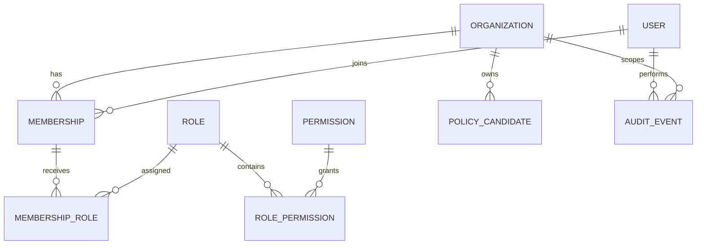
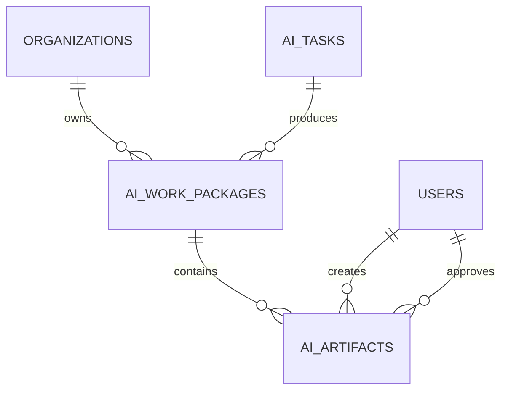

# Entity Relationship Overview



The actual schema is authoritative. This diagram describes domain intent and must be updated when models change.
## Sprint 4 artifact lineage

Artifact payloads are limited to 64 KiB and exclude raw provider responses, secrets, and hidden reasoning.
## Knowledge chunk lineage

```text
KnowledgeSource (organization)
  └─ KnowledgeDocument
       └─ KnowledgeDocumentVersion
            ├─ KnowledgeChunk [config_hash, index, locator, content_hash]
            │    └─ CitationReference [source/document/version/chunk lineage]
            └─ active_chunking_config_hash
```

Every edge includes `organization_id` in its foreign key. Citation-to-chunk deletion remains restrictive so citation lineage cannot be silently orphaned.
