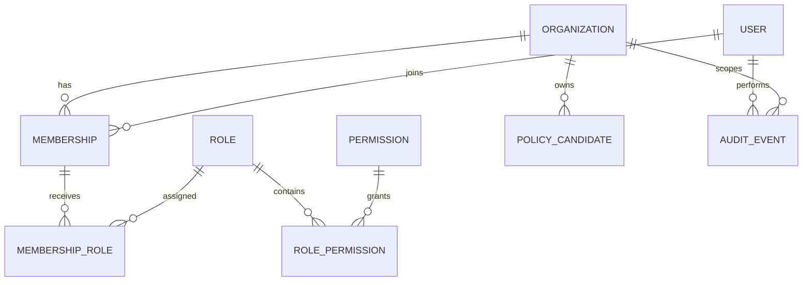
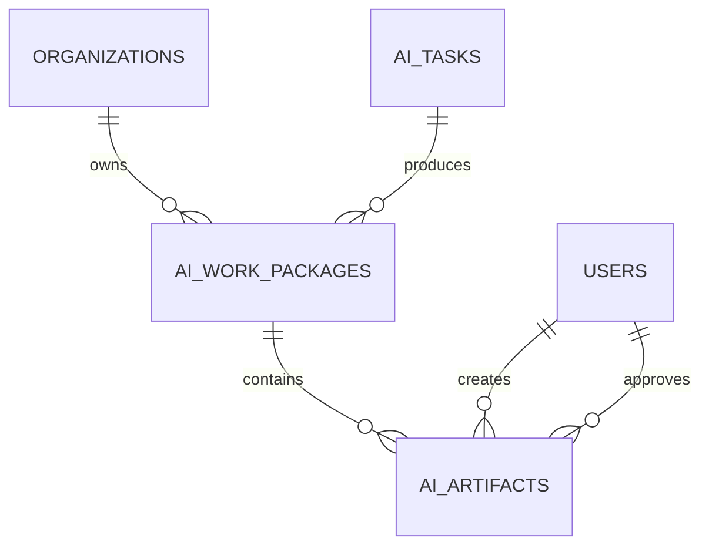

# Entity Relationship Overview



The actual schema is authoritative. This diagram describes domain intent and must be updated when models change.
## Sprint 4 artifact lineage

Artifact payloads are limited to 64 KiB and exclude raw provider responses, secrets, and hidden reasoning.
## Knowledge chunk lineage

```text
KnowledgeSource (organization)
  └─ KnowledgeDocument
       └─ KnowledgeDocumentVersion
            ├─ KnowledgeChunk [config_hash, index, locator, content_hash]
            │    └─ CitationReference [source/document/version/chunk lineage]
            └─ active_chunking_config_hash
```

Every edge includes `organization_id` in its foreign key. Citation-to-chunk deletion remains restrictive so citation lineage cannot be silently orphaned.

## Sprint 6 Checkpoint 4: Embedding and vector retrieval

- Embeddings use a provider-independent gateway (`fake`, `disabled`, or explicitly configured `openai`).
- Model, dimension, chunking configuration, normalization strategy, provider, and policy version participate in immutable embedding revisions.
- The default fake provider is SHA-256 deterministic and performs no network I/O. OpenAI uses bounded application retries while SDK retries are disabled.
- External embedding follows provider transmission policy: restricted content is blocked and confidential content requires organization policy. Embedding records never duplicate source text or secrets.
- Current persistence stores validated vectors as JSON for PostgreSQL/SQLite compatibility. `VectorStore` isolates this detail; production pgvector indexing is planned and must fail clearly if the extension is unavailable.
- Retrieval enforces organization, model, dimension, classification, document/source, effective-date, top-k, and minimum-score filters. Cosine scores remain in the native [-1, 1] range.
- Usage records capture input count/tokens, batch/retry count, latency, provider request ID and nullable estimated cost; pricing is not hard-coded.
- Public embedding/search HTTP endpoints are deferred; application services are the authorization-ready boundary.

## Sprint 6 Checkpoint 6: Governed MCP gateway

MCP is an untrusted integration boundary governed by explicit server and tool allowlists. Five disabled-by-configuration connector definitions cover law, minutes, finance, internal documents, and public data. Fake clients are the test default; remote networking and local process execution require explicit opt-in and are not implemented as implicit fallbacks.

Every call validates active membership, RBAC permission, organization scope, classification, read/write consequences, human approval, JSON schemas, paths, URLs, result size, and suspicious prompt/script markers. Restricted data cannot leave PolicyOS; confidential external transmission needs organization policy. Cancellation propagates, retries are bounded to transient failures, and stale cache usage is disclosed.

Audit records contain identifiers, policy decisions, timing, retry/result counts and status only—never arguments, results, credentials, tokens, or document text. Cache keys are organization/classification scoped and hash normalized parameters. Connector outputs become untrusted `EvidenceCandidate` records with provenance and incomplete-citation warnings. Real national law, meeting, budget MCP connections, distributed cache, and management/execution HTTP APIs remain follow-up work.

## Sprint 6 Checkpoint 8: Evidence-aware AI Office

The production Office application service can receive an injected governed Knowledge Router before specialist execution. It builds one organization-scoped query, rejects wholly unavailable evidence, converts the router result to a minimized `OfficeEvidencePackage`, and stores only query/route identifiers plus counts, confidence, sufficiency, failures, and fallback status on the Work Package.

`AgentContext` carries the optional package. The Chief Secretary workflow deterministically selects legal evidence for Legal Review, budget evidence for Budget Analysis, statistical evidence for Statistics, and approved cited facts for public-facing agents. Safe excerpts, classifications, stable evidence IDs and existing citation IDs propagate through AgentResult and artifact structured payloads; agents cannot create substitute citations. All approved prompt files instruct agents to use supplied evidence only and expose conflicts, gaps, stale sources and unsupported claims.

Partial/insufficient evidence, material gaps, unresolved conflicts, incomplete or stale citations, public-facing artifacts, unsupported claims, or partial Agent failures require review. Approval is never automatic. Evidence-unavailable execution stops before provider calls. Existing timeout, cancellation, privacy, provider telemetry and artifact review controls remain authoritative. API request schemas accept legal/budget/minutes workflows and source/date/fiscal context; production router/executor composition in the HTTP dependency container remains follow-up work.
