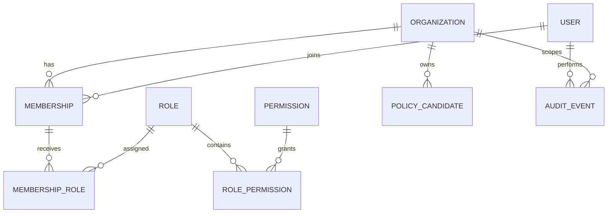
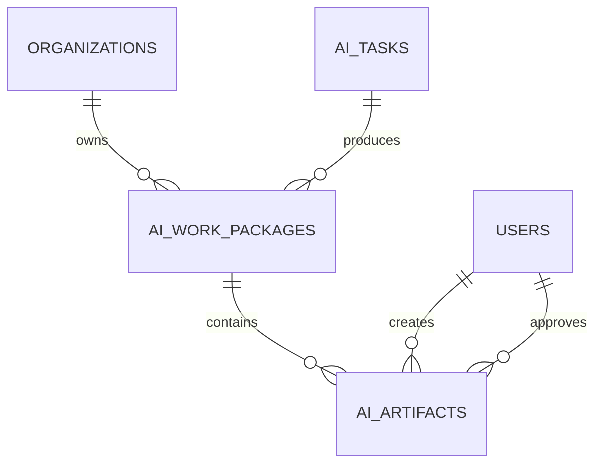

# Entity Relationship Overview



The actual schema is authoritative. This diagram describes domain intent and must be updated when models change.
## Sprint 4 artifact lineage

Artifact payloads are limited to 64 KiB and exclude raw provider responses, secrets, and hidden reasoning.
## Knowledge chunk lineage

```text
KnowledgeSource (organization)
  └─ KnowledgeDocument
       └─ KnowledgeDocumentVersion
            ├─ KnowledgeChunk [config_hash, index, locator, content_hash]
            │    └─ CitationReference [source/document/version/chunk lineage]
            └─ active_chunking_config_hash
```

Every edge includes `organization_id` in its foreign key. Citation-to-chunk deletion remains restrictive so citation lineage cannot be silently orphaned.

## Sprint 6 Checkpoint 4: Embedding and vector retrieval

- Embeddings use a provider-independent gateway (`fake`, `disabled`, or explicitly configured `openai`).
- Model, dimension, chunking configuration, normalization strategy, provider, and policy version participate in immutable embedding revisions.
- The default fake provider is SHA-256 deterministic and performs no network I/O. OpenAI uses bounded application retries while SDK retries are disabled.
- External embedding follows provider transmission policy: restricted content is blocked and confidential content requires organization policy. Embedding records never duplicate source text or secrets.
- Current persistence stores validated vectors as JSON for PostgreSQL/SQLite compatibility. `VectorStore` isolates this detail; production pgvector indexing is planned and must fail clearly if the extension is unavailable.
- Retrieval enforces organization, model, dimension, classification, document/source, effective-date, top-k, and minimum-score filters. Cosine scores remain in the native [-1, 1] range.
- Usage records capture input count/tokens, batch/retry count, latency, provider request ID and nullable estimated cost; pricing is not hard-coded.
- Public embedding/search HTTP endpoints are deferred; application services are the authorization-ready boundary.
