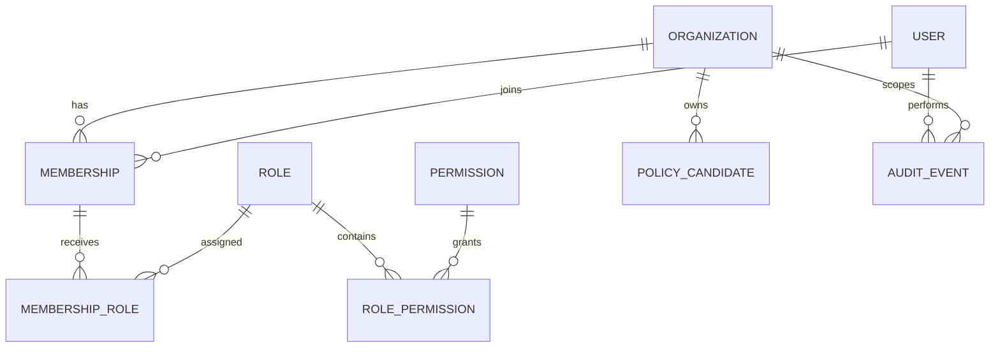

# Entity Relationship Overview

```mermaid
erDiagram
    ORGANIZATION ||--o{ MEMBERSHIP : has
    USER ||--o{ MEMBERSHIP : joins
    MEMBERSHIP ||--o{ MEMBERSHIP_ROLE : receives
    ROLE ||--o{ MEMBERSHIP_ROLE : assigned
    ROLE ||--o{ ROLE_PERMISSION : contains
    PERMISSION ||--o{ ROLE_PERMISSION : grants
    ORGANIZATION ||--o{ POLICY_CANDIDATE : owns
    USER ||--o{ AUDIT_EVENT : performs
    ORGANIZATION ||--o{ AUDIT_EVENT : scopes
```

The actual schema is authoritative. This diagram describes domain intent and must be updated when models change.
