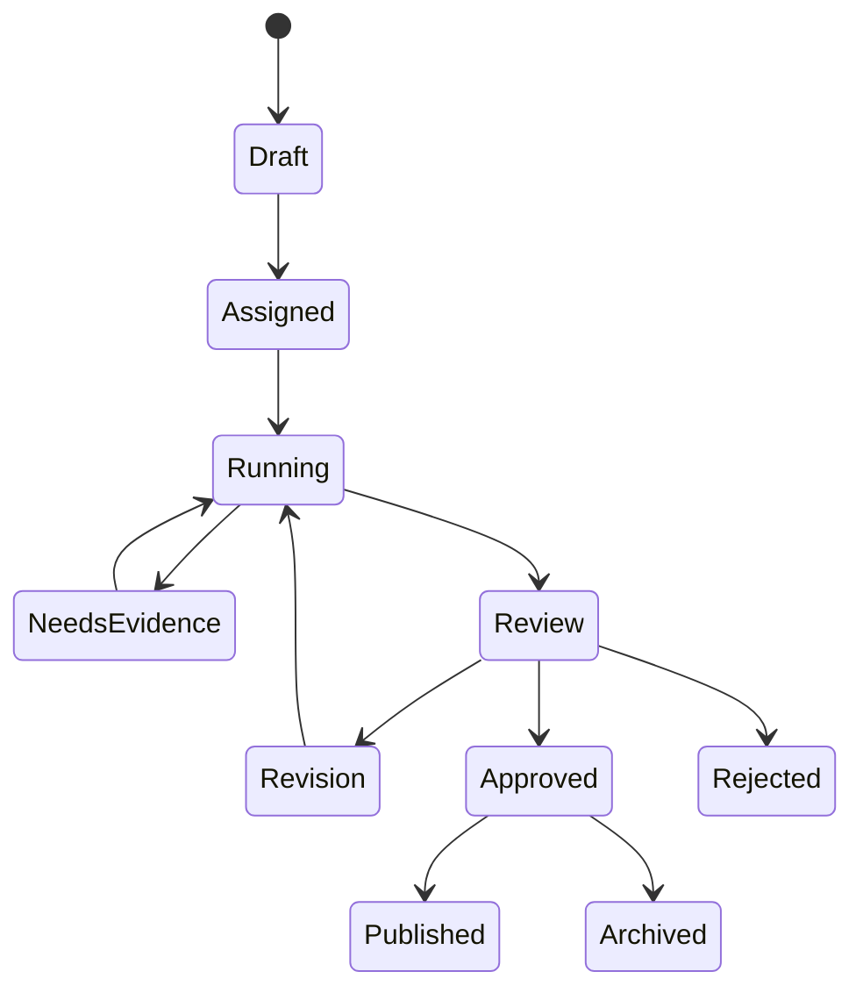

# AI Workflow States

Consequential external actions must not move to `Published` without an authorized human approval record.
## Work-package workflows
- Policy package: Policy Research → Legal Review → Budget Analysis → Statistics
- Communication package: Policy Research → Press/PR → SNS → Speech Writer
- Presentation package: Policy Research → Statistics → PPT Designer
- Full office package: all eight agents in deterministic dependency order

Partial failures remain reviewable. Public-facing artifacts cannot advance beyond review without an authorized human approval record.

## Production Work Package lifecycle

1. The API verifies active organization membership and `agent.execute`.
2. The application service resolves an organization-scoped idempotency key.
3. AI task, Work Package, and planned agent runs are stored as running.
4. The configured provider and approved prompts are composed without provider-aware agents.
5. The existing Office workflow executes the selected route.
6. Each run stores success/failure, safe error, provider response ID, and usage telemetry.
7. Successful specialist results become reviewable artifacts; provider audit metadata is committed.
8. All-success and partial outcomes become `needs_review`; total failure becomes `failed`.
9. Cancellation marks task, package, and runs `cancelled` before cancellation propagates.

Supported routes are `policy_package`, `communication_package`, `presentation_package`, and
`full_office_package`. A failed specialist can never be reported as a successful package.
## Release smoke invariants

- An all-agent provider failure is `failed`; a partial failure is `needs_review`; cancellation is `cancelled`.
- Completed model calls still produce `needs_review` artifacts until authorized human review.
- Every planned run reaches a terminal state and remains scoped to its task and organization.
- OpenAI transmissions pass policy and redaction before the provider call; audit and usage metadata are recorded without prompt or raw response content.
- The release smoke selection is `pytest -m smoke`; it never enables live OpenAI access.

## Sprint 6 Checkpoint 7: Governed knowledge routing

The Knowledge Router uses deterministic rules—not an LLM planner—to classify policy, legal, ordinance, minutes, budget, statistics, internal-document, speech, press, combined, and unknown queries. Its route matrix selects organization-scoped Hybrid RAG and allowlisted MCP connectors, runs independent sources concurrently within one timeout budget, preserves partial results, and records denied or failed sources instead of reporting false success.

Evidence is normalized into one contract, deduplicated by stable external/citation/content identity, capped per source/document, and ranked with retrieval relevance, official-source category, citation completeness, freshness and stable identifiers. Different institutions remain distinct. Legal effective-date and budget fiscal-year conflicts are surfaced without silently choosing a winner. Type-specific gaps lower confidence and material/critical gaps require human review.

Fallback provenance, stale warnings, source failures, permissions and review requirements remain visible. Restricted data cannot use external routes, and MCP receives only connector-specific parameters and opaque request metadata. Router audit stores query hashes, selected/executed/denied sources, counts, status, confidence and latency—never query text, evidence text, credentials, raw MCP results or reasoning. Real connector wiring and `/api/v1/knowledge/query` remain follow-up application-container work.

## Sprint 6 Checkpoint 8: Evidence-aware AI Office

The production Office application service can receive an injected governed Knowledge Router before specialist execution. It builds one organization-scoped query, rejects wholly unavailable evidence, converts the router result to a minimized `OfficeEvidencePackage`, and stores only query/route identifiers plus counts, confidence, sufficiency, failures, and fallback status on the Work Package.

`AgentContext` carries the optional package. The Chief Secretary workflow deterministically selects legal evidence for Legal Review, budget evidence for Budget Analysis, statistical evidence for Statistics, and approved cited facts for public-facing agents. Safe excerpts, classifications, stable evidence IDs and existing citation IDs propagate through AgentResult and artifact structured payloads; agents cannot create substitute citations. All approved prompt files instruct agents to use supplied evidence only and expose conflicts, gaps, stale sources and unsupported claims.

Partial/insufficient evidence, material gaps, unresolved conflicts, incomplete or stale citations, public-facing artifacts, unsupported claims, or partial Agent failures require review. Approval is never automatic. Evidence-unavailable execution stops before provider calls. Existing timeout, cancellation, privacy, provider telemetry and artifact review controls remain authoritative. API request schemas accept legal/budget/minutes workflows and source/date/fiscal context; production router/executor composition in the HTTP dependency container remains follow-up work.
