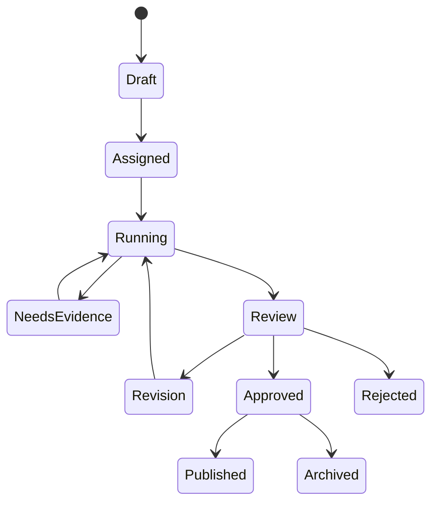

# AI Workflow States

```mermaid
stateDiagram-v2
    [*] --> Draft
    Draft --> Assigned
    Assigned --> Running
    Running --> NeedsEvidence
    Running --> Review
    NeedsEvidence --> Running
    Review --> Revision
    Revision --> Running
    Review --> Approved
    Review --> Rejected
    Approved --> Published
    Approved --> Archived
```

Consequential external actions must not move to `Published` without an authorized human approval record.
