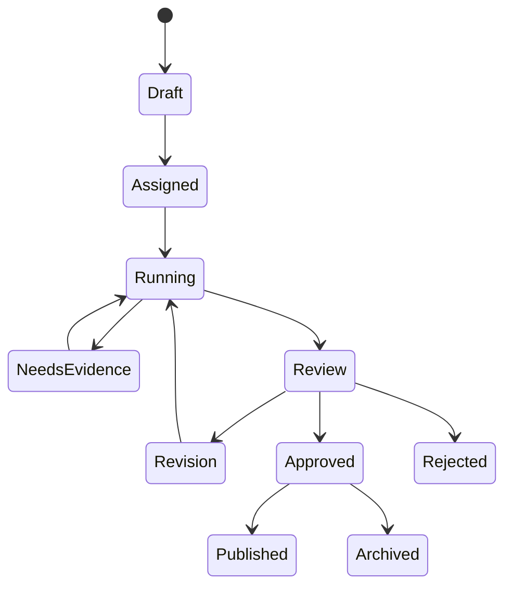

# AI Workflow States

Consequential external actions must not move to `Published` without an authorized human approval record.
## Work-package workflows
- Policy package: Policy Research → Legal Review → Budget Analysis → Statistics
- Communication package: Policy Research → Press/PR → SNS → Speech Writer
- Presentation package: Policy Research → Statistics → PPT Designer
- Full office package: all eight agents in deterministic dependency order

Partial failures remain reviewable. Public-facing artifacts cannot advance beyond review without an authorized human approval record.
