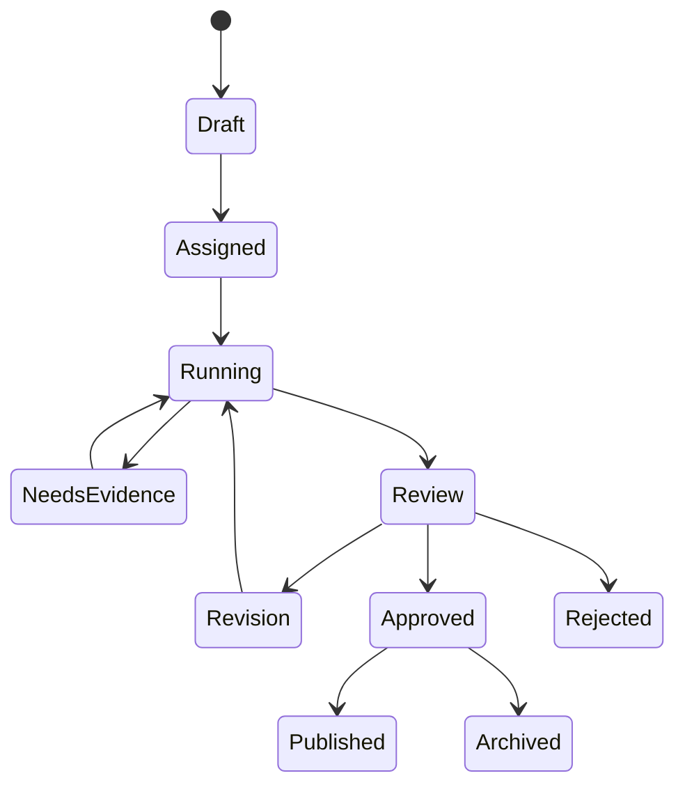

# AI Workflow States

Consequential external actions must not move to `Published` without an authorized human approval record.
## Work-package workflows
- Policy package: Policy Research → Legal Review → Budget Analysis → Statistics
- Communication package: Policy Research → Press/PR → SNS → Speech Writer
- Presentation package: Policy Research → Statistics → PPT Designer
- Full office package: all eight agents in deterministic dependency order

Partial failures remain reviewable. Public-facing artifacts cannot advance beyond review without an authorized human approval record.

## Production Work Package lifecycle

1. The API verifies active organization membership and `agent.execute`.
2. The application service resolves an organization-scoped idempotency key.
3. AI task, Work Package, and planned agent runs are stored as running.
4. The configured provider and approved prompts are composed without provider-aware agents.
5. The existing Office workflow executes the selected route.
6. Each run stores success/failure, safe error, provider response ID, and usage telemetry.
7. Successful specialist results become reviewable artifacts; provider audit metadata is committed.
8. All-success and partial outcomes become `needs_review`; total failure becomes `failed`.
9. Cancellation marks task, package, and runs `cancelled` before cancellation propagates.

Supported routes are `policy_package`, `communication_package`, `presentation_package`, and
`full_office_package`. A failed specialist can never be reported as a successful package.
